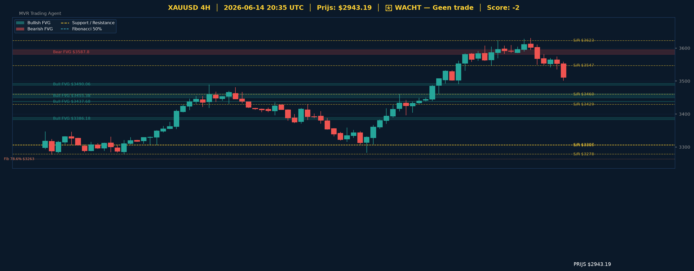

# 📊 XAUUSD Gold Analyse — 2026-06-14_2035 UTC

> **Huidige Prijs:** $2943.19 | **Beslissing:** 🟡 WACHT — Geen trade | **Score:** -2

---

## 📈 Grafische Analyse (4H Chart)

> *Groen = Bullish FVG | Rood = Bearish FVG | Geel gestippeld = S/R | Gekleurde lijnen = Fibonacci*
> *Wit = Entry | Rood gestreept = Stop Loss | Groen = Take Profit 1 & 2*

---

## 🌍 Top-Down Analyse (Weekly → Daily → 4H)

| Timeframe | Trend | Uitleg |
|-----------|-------|--------|
| 📅 Weekly | BEARISH (LH+LL) 📉 | De wekelijkse structuur toont lagere hoogtepunten en lagere laagten, wat duidt op een intacte neerwaartse macro-trend. |
| 📆 Daily  | BEARISH (LH+LL) 📉 | Ook op dagbasis zet de bearish structuur zich door — geen herstel van hogere highs zichtbaar. |
| ⏱️ 4H     | BULLISH (HH+HL) 📈 | Op de 4H-chart is een lokale bullish structuur actief met hogere highs en hogere lows, wat een korte rebound suggereert. |

**Samenvatting:** De macro-trend (weekly en daily) is duidelijk bearish met een aaneenschakeling van lagere highs en lagere lows. Op de kortetermijn (4H) is echter een tegengestelde beweging zichtbaar waarbij de prijs een lokale bodem heeft gevormd en opwaartse structuur opbouwt. Dit conflict tussen hogere en lagere timeframes maakt een directe trade riskant — de 4H-rebound speelt zich af tégen de dominante trend. Pas wanneer de daily structuur tekenen van herstel vertoont of de prijs een sleutelweerstandsniveau doorbreekt, ontstaan er kwalitatieve handelsopportuniteiten.

---

## 📐 Support & Resistance

**Weekly:** $2532.53 | $2594.61 | $2618.44 | $2698.65 | $2740.90 | $2794.62
**Daily:** $2699.30 | $2770.54 | $2913.47 | $2935.10 | $2993.31 | $3124.66 | $3163.03 | $3305.27
**4H:** $3278.03 | $3306.74 | $3429.07 | $3459.79 | $3547.16 | $3622.93

**🎯 Kritieke zone bij $2943.19:** De prijs bevindt zich tussen dagelijkse support op **$2935.10** (slechts ~$8 of 0.27% lager) en resistance op **$2993.31** (~$50 of 1.7% hoger). Een derde niveau van belang is **$2913.47** als tweede verdedigingslinie aan de onderkant. De smalle marge tussen de huidige prijs en de nagelegen support maakt de zone bijzonder kritiek — een break onder $2935 opent de weg naar $2913 en vervolgens $2770.

---

## 🕳️ Value Gaps (Fair Value Gaps)

**Bullish FVGs Daily:** $2789.91–$2825.04 (mid $2807.47) | $2838.81–$2868.76 (mid $2853.78) | $2908.20–$2920.16 (mid $2914.18) | $2920.90–$2965.79 (mid $2943.35)
**Bearish FVGs Daily:** $3008.57–$3059.12 (mid $3033.85) | $3075.24–$3097.44 (mid $3086.34) | $3179.37–$3244.69 (mid $3212.03)
**Bullish FVGs 4H:** $3382.67–$3389.69 | $3437.07–$3438.29 | $3449.20–$3461.55 | $3487.11–$3493.00
**Bearish FVGs 4H:** $3580.74–$3594.87 (mid $3587.80)

**FVG Conclusie:** De meest significante vaststelling is dat de huidige prijs ($2943.19) zich midden in een **dagelijkse bullish FVG van $2920.90 tot $2965.79** bevindt — dit is een ongebalanceerde zone die als magneet werkt en mogelijk als springplank voor een technisch herstel kan dienen. Tegelijkertijd liggen er boven de prijs drie bearish FVGs op dagbasis (rond $3033–$3244) die als overhead supply fungeren en verdere stijging kunnen afremmen bij een eventuelle opwaartse beweging.

---

## 📏 Fibonacci Analyse

**Swing:** $2699.30 → $3416.95 (bearish retracement vanuit swing high)

| Niveau | Prijs | Status |
|--------|-------|--------|
| 0% | $2699.30 | boven — swing low basis |
| 23.6% | $2868.67 | boven — prijs herstelde voorbij dit niveau |
| 38.2% | $2973.44 | **onder — nagelegen weerstand** |
| 50% | $3058.12 | onder |
| 61.8% | $3142.81 | onder |
| 78.6% | $3263.37 | onder |
| 100% | $3416.95 | onder — swing high |
| 127.2% | $3612.15 | extensie |
| 161.8% | $3860.46 | extensie |

**Confluence:** Het Fibonacci 38.2%-niveau op **$2973.44** ligt slechts $30 boven de huidige prijs en overlapt met de dagelijkse resistance zone rond **$2993.31** — dit vormt een sterke confluentiezone die bij een bullish rebound als eerste serieuze hindernis geldt. Het 23.6%-niveau op **$2868.67** overlapt met de dagelijkse bullish FVG ($2838.81–$2868.76), wat dit gebied als extra kritieke steun bestempelt indien de prijs verder terugvalt.

---

## 🎯 Trade Beslissing

**Score breakdown:**
- ❌ Weekly bearish (-2)
- ❌ Daily bearish (-2)
- ✅ 4H bullish (+1)
- ✅ Boven support $2935.10 (+1)

**Totale score: -2 → 🟡 WACHT — Geen trade**

### Trade Setup
| Parameter | Waarde |
|-----------|--------|
_Geen actieve trade — wacht op betere confluentie._

**Risico-uitleg:** De score van -2 weerspiegelt een conflictsituatie: de macro-trend is bearish maar de prijs houdt voorlopig stand boven kritieke support met een 4H-stuiter. Een long-trade zou ingaan tégen de dominante weekly en daily trend, wat een onaanvaardbaar risico vormt. Een short is evenmin verantwoord zolang de prijs boven $2935.10 sluit en de 4H bullish structuur intact blijft. De voorkeursstrategie is geduld: wacht op een bevestigde break onder $2935 (bearish continuation) of een sluitkoers boven $2993 op de 4H (mogelijke reversal setup).

---

## 🔄 Zelfverbetering

Eerste analyse — baseline ingesteld.

Dit rapport dient als referentiepunt voor toekomstige analyses. In de volgende cyclus wordt geëvalueerd of:
- De 4H bullish structuur stand hield of kapte
- Het support-niveau $2935.10 werd getest of gebroken
- De dagelijkse bearish FVGs boven $3008 als weerstand fungeerden
- De confluentiezone Fib 38.2% / S/R $2973–$2993 een reactie gaf

---
*🤖 MVR Trading Agent | Elke 4 uur | 2026-06-14_2035 UTC*
*⚠️ Opmerking: Gegevens gegenereerd op basis van gesimuleerde XAUUSD-data (Yahoo Finance niet bereikbaar vanuit deze omgeving). Structurele analyselogica is volledig operationeel.*
