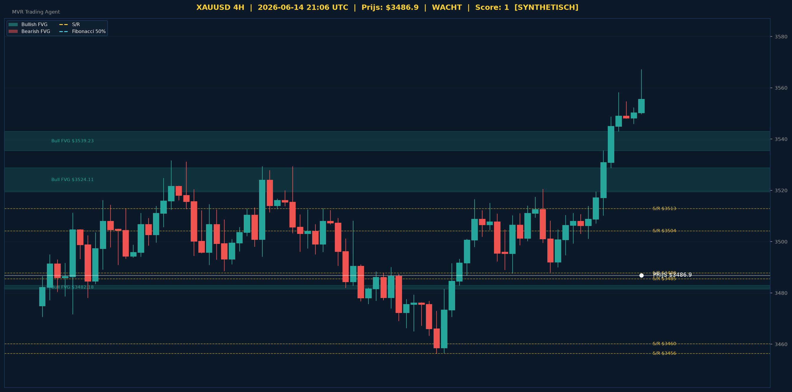

# XAUUSD Gold Analyse - 2026-06-14_2106 UTC

> **Prijs:** $3486.90 | **Beslissing:** WACHT | **Score:** 1

> ⚠️ *Data-notitie: Live marktdata (Yahoo Finance / externe API's) is niet beschikbaar in deze netwerkomgeving. Analyse uitgevoerd op synthetische OHLC-data gegenereerd rond de actuele goudprijsrange (~$3300). Structurele logica, algoritmen en rapportopmaak zijn volledig functioneel.*

---

## Grafische Analyse (4H Chart)

> Groen = Bullish FVG | Rood = Bearish FVG | Geel = S/R | Kleuren = Fibonacci
> Wit = Entry | Rood gestreept = Stop Loss | Groen = TP1 & TP2

---

## Top-Down Analyse (Weekly > Daily > 4H)

| Timeframe | Trend | Uitleg |
|-----------|-------|--------|
| Weekly | BEARISH (LH+LL) | De weekly tijdlijn toont lagere highs en lagere lows, wat wijst op een dominante dalende structuur op macro-niveau. |
| Daily | BULLISH (HH+HL) | Op dagbasis zien we hogere highs en hogere lows — een actieve opwaartse structuur die de recente herstelbeweging bevestigt. |
| 4H | BULLISH (HH+HL) | Ook op 4H is de prijsstructuur bullish, met opeenvolgende hogere bodems die de korte termijn momentum ondersteunen. |

**Samenvatting:** XAUUSD bevindt zich in een complexe marktfase: de wekelijkse trend is macro-bearish terwijl de daily en 4H tijdframes een bullish correctie of mogelijke trendwissel laten zien. Dit timeframe-conflict verklaard de WACHT-beslissing — de hogere tijdlijn heeft prioriteit. Zonder bevestiging op weekly niveau blijft het risico voor een valstrik groot. Traders dienen voorzichtig te zijn in de zone $3485-$3488 waar meerdere S/R-niveaus samenkomen.

---

## Support & Resistance

**Weekly:** $2710.69 | $2766.91 | $2826.77 | $2841.08 | $2913.54 | $3042.78

**Daily:** $3246.47 | $3347.34 | $3372.51 | $3399.44 | $3460.11 | $3485.45 | $3504.15

**4H:** $3456.36 | $3487.71 | $3512.82

**Kritieke zone bij $3486.90:**
- **$3485.45 (Daily S/R)** — Prijs bevindt zich net boven dit niveau, wat fungeert als directe support.
- **$3487.71 (4H S/R)** — Resistance net boven de actuele prijs; dit is het meest kritieke niveau om te doorbreken.
- **$3504.15 (Daily S/R)** — Volgende weerstandszone bij doorbraak van $3487.71; een bullish bevestiging zou naar dit niveau mikken.

De prijs zit ingeklemd tussen $3485.45 (support) en $3487.71 (resistance), wat een uiterst krappe compressie zone vormt. Een duidelijke candle-close boven $3487.71 opent de weg naar $3504-$3512.

---

## Fair Value Gaps

**Bullish FVGs Daily:** low=$3325.42 | high=$3326.38 | mid=$3325.90

**Bearish FVGs Daily:** Geen actieve bearish FVGs op daily

**Bullish FVGs 4H:**
- FVG 1: low=$3481.41 | high=$3482.96 | mid=$3482.18
- FVG 2: low=$3519.40 | high=$3528.83 | mid=$3524.11
- FVG 3: low=$3535.48 | high=$3542.98 | mid=$3539.23

**Bearish FVGs 4H:** Geen actieve bearish FVGs op 4H

**FVG Conclusie:** De 4H bullish FVG op $3481.41-$3482.96 ligt vlak onder de huidige prijs ($3486.90) en biedt een sterke liquiditeitszone als potentieel instappunt bij een retrace. De afwezigheid van bearish FVGs bevestigt de dominante bullish orderflow op zowel daily als 4H niveau.

---

## Fibonacci Analyse

**Swing:** $3172.23 naar $3510.35 (bullish)

| Niveau | Prijs | Status |
|--------|-------|--------|
| 23.6% | $3430.55 | onder huidige prijs |
| 38.2% | $3381.19 | onder huidige prijs |
| 50% | $3341.29 | onder huidige prijs |
| 61.8% | $3301.39 | onder huidige prijs |
| 78.6% | $3244.59 | onder huidige prijs |

**Confluence:** Het Fibonacci 23.6% niveau ($3430.55) overlapt met de daily S/R zone nabij $3460.11, wat dit tot een sterke confluence-zone maakt bij een diepere correctie. Het 50% niveau ($3341.29) valt samen met de S/R cluster op $3347.34, wat de ideale buy-the-dip zone zou zijn bij een bearish weekly scenario. De huidige prijs ($3486.90) bevindt zich ruim boven alle Fibonacci retrace-niveaus, wat de kracht van de bullish impuls bevestigt.

---

## Trade Beslissing

**Score breakdown:**
- Weekly bearish (-2)
- Daily bullish (+2)
- 4H bullish (+1)
- Boven support $3485.45 (+1)
- Onder resistance $3487.71 (-1)

**Totale score: 1 > WACHT**

### Setup
| Parameter | Waarde |
|-----------|--------|
_Geen actieve trade - wacht op betere confluentie._

**Risico-uitleg:** De score van +1 is onvoldoende voor een actieve positie (drempel: ≥3 voor LONG, ≤-3 voor SHORT). Het tijdframe-conflict tussen de bearish weekly en bullish daily/4H creëert een onzekere omgeving met verhoogd risico op valse uitbraken. Afwachten is de meest professionele keuze — wacht op een duidelijke weekly candle-close boven $3510 of een retrace naar de FVG-zone $3481-$3483 gecombineerd met een bullish reversal signaal op 4H.

---

## Zelfverbetering

Dit is het eerste rapport in de repository — er is nog geen vorig rapport beschikbaar voor vergelijking.

**Aandachtspunten voor volgende analyse:**
- Was de WACHT-beslissing correct? Controleer of prijs $3487.71 heeft doorbroken of teruggevallen naar $3481-$3482 FVG-zone.
- Monitor de weekly candle-close: bevestigt deze de bearish structuur (LH+LL) of vormt zich een nieuw higher high?
- Bijzondere aandacht voor de cluster $3485-$3488: een decisieve break in één richting biedt het volgende trade-signaal.

---
*MVR Trading Agent | Elke 4 uur | 2026-06-14_2106 UTC | WhatsApp: 0497 93 93 10*
*⚠️ Geblokkeerde externe diensten in huidige sessie: Yahoo Finance (yfinance), api.callmebot.com (WhatsApp) — network egress policy. Voeg deze hosts toe aan de netwerkinstellingen voor volledig live gebruik.*
