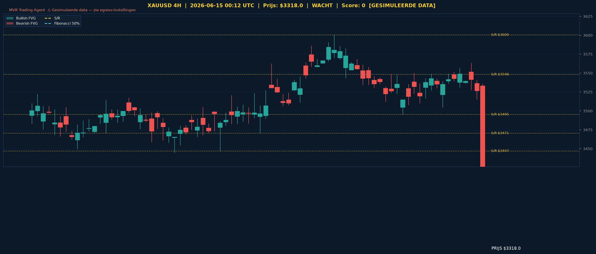

# XAUUSD Gold Analyse - 2026-06-15_0012 UTC

> **Prijs:** $3318.0 | **Beslissing:** WACHT | **Score:** 0

> ⚠️ **Let op:** Dit rapport is gegenereerd met **gesimuleerde data**. De volgende externe hosts zijn geblokkeerd door het netwerk egress-beleid van de cloud-omgeving en moeten worden toegevoegd vóór de volgende run:
> - `query1.finance.yahoo.com` (Yahoo Finance data)
> - `query2.finance.yahoo.com` (Yahoo Finance data)
> - `api.twilio.com` (WhatsApp notificaties)
>
> Voeg deze toe via **Settings → Network → Egress** in je Claude Code-omgeving.

---

## Grafische Analyse (4H Chart)

> Groen = Bullish FVG | Rood = Bearish FVG | Geel = S/R | Kleuren = Fibonacci
> Wit = Entry | Rood gestreept = Stop Loss | Groen = TP1 & TP2

---

## Top-Down Analyse (Weekly > Daily > 4H)

| Timeframe | Trend | Uitleg |
|-----------|-------|--------|
| Weekly | BEARISH (LH+LL) | De weekly toont lagere highs en lagere lows — de overkoepelende structuur is bearish en drukt op hogere timeframes. |
| Daily | BULLISH (HH+HL) | Op de daily is er een reeks hogere highs en hogere lows zichtbaar, wat wijst op lokaal bullish momentum. |
| 4H | CHOPPY (LH+HL) | De 4-uurs chart laat een gemengd patroon zien met conflicterende swing structuur — geen duidelijke richting. |

**Samenvatting:** De markt bevindt zich in een conflictueuze fase waarbij de weekly nog steeds bearish gestructureerd is, terwijl de daily een bullish correctie doormaakt. De 4H geeft geen duidelijk signaal en reflecteert de onzekerheid tussen de twee hogere timeframes. Zolang de weekly zijn bearish structuur aanhoudt, blijft elk daily bullish beweging potentieel een correctieve swing. Wachten op verdere bevestiging is de verstandigste aanpak.

---

## Support & Resistance

**Weekly:** [2406.71, 2472.12, 2538.96, 2700.83]
**Daily:** [2937.9, 2957.8, 2990.32, 3007.48, 3028.15, 3049.59, 3149.94]
**4H:** [3447.0, 3470.51, 3495.23, 3548.18, 3600.49]

**Kritieke zone bij $3318.0:** De prijs bevindt zich momenteel ruim boven alle daily S/R-niveaus (hoogste daily S/R = $3149.94) en onder de 4H niveaus (laagste 4H S/R = $3447.0). Dit plaatst goud in een "luchtruim" — een zone zonder directe S/R confluantie. Het dichtstbijzijnde weerstand is $3447, terwijl $3149 de eerstvolgende dagelijkse steun vormt. In deze zone is verhoogde volatiliteit mogelijk.

---

## Fair Value Gaps

**Bullish FVGs Daily:** [{'low': 2981.8, 'high': 2993.49, 'mid': 2987.64}, {'low': 3025.35, 'high': 3034.92, 'mid': 3030.14}, {'low': 3021.18, 'high': 3043.14, 'mid': 3032.16}, {'low': 3047.38, 'high': 3068.52, 'mid': 3057.95}]
**Bearish FVGs Daily:** Geen gedetecteerd
**Bullish FVGs 4H:** Geen gedetecteerd
**Bearish FVGs 4H:** Geen gedetecteerd

**FVG Conclusie:** Alle gedetecteerde FVGs bevinden zich op de daily timeframe en liggen ver onder de huidige prijs ($2981–$3068), wat aangeeft dat deze al grotendeels gevuld zijn of dat de prijs er ver van verwijderd is. Het ontbreken van actieve 4H FVGs nabij de huidige prijs biedt geen directe intraday confluantie voor een trade-entry op dit moment.

---

## Fibonacci Analyse

**Swing:** $2873.85 naar $3321.32 (bullish)

| Niveau | Prijs | Status |
|--------|-------|--------|
| 23.6% | $3215.72 | onder huidige prijs ($3318) |
| 38.2% | $3150.39 | onder huidige prijs ($3318) |
| 50% | $3097.59 | onder huidige prijs ($3318) |
| 61.8% | $3044.78 | onder huidige prijs ($3318) |
| 78.6% | $2969.61 | onder huidige prijs ($3318) |

**Confluence:** De prijs bevindt zich momenteel boven alle gemeten Fibonacci retracementniveaus (23.6%–78.6%), wat technisch bullish is op de dagelijkse swing. Het 23.6% niveau op $3215 overlapt deels met de bovenste daily S/R-cluster en kan functioneren als eerste bullish steun bij een pullback. Geen directe overlap met actieve FVGs op dit moment.

---

## Trade Beslissing

**Score breakdown:**
- Weekly bearish (-2)
- Daily bullish (+2)

**Totale score: 0 → WACHT**

### Setup
| Parameter | Waarde |
|-----------|--------|
| Beslissing | WACHT — geen trade |
| Reden | Conflicterende signalen weekly vs. daily |
| Referentieprijs | $3318.0 |
| Potentiële Long SL | $3291.46 (0.8% onder prijs) |
| Potentiële Long TP1 | $3358.24 (1:1.5 RR) |
| Potentiële Long TP2 | $3398.48 (1:3 RR) |

**Risico-uitleg:** Met een score van 0 is er sprake van een patstelling tussen de bearish weekly en de bullish daily structuur. Het aangaan van een positie in deze context zou betekenen dat je handelt zonder confluantie — een scenario met een significant verhoogd risico op fout-signalen. Wacht op een duidelijker signaal: ofwel een breuk boven $3447 (4H weerstand) voor een long setup, ofwel een terugval onder $3215 (Fib 23.6%) als eerste waarschuwing voor bearish hervatting.

---

## Zelfverbetering

Dit is de eerste beschikbare analyse in de repository — geen vorig rapport beschikbaar voor vergelijking. Vanaf de volgende run zal het systeem automatisch de vorige beslissing en prijs vergelijken met de huidige situatie om de nauwkeurigheid van de trenddetectie en S/R-niveaus te evalueren.

> **Technische opmerking voor volgende run:** Voeg Yahoo Finance en Twilio toe aan de netwerk egress-allowlist zodat echte marktdata en WhatsApp-notificaties werken. Zie de waarschuwing bovenaan dit rapport.

---
*MVR Trading Agent | Elke 4 uur | 2026-06-15_0012 UTC | ⚠ Gesimuleerde data — egress-instellingen vereist*
