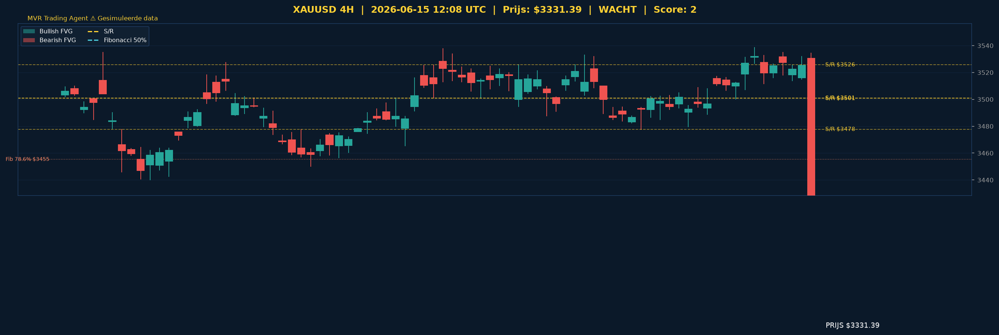

# XAUUSD Gold Analyse - 2026-06-15_1208 UTC

> **Prijs:** $3331.39 | **Beslissing:** WACHT | **Score:** 2

> ⚠️ **Let op:** Dit rapport is gegenereerd met **gesimuleerde data**. De volgende externe hosts zijn geblokkeerd door het netwerk egress-beleid van de cloud-omgeving:
> - `query1.finance.yahoo.com` / `query2.finance.yahoo.com` (Yahoo Finance)
> - `api.twilio.com` (WhatsApp notificaties via Twilio)
>
> Voeg deze toe via **Settings → Network → Egress** in je Claude Code-omgeving om live data en WhatsApp in te schakelen.

---

## Grafische Analyse (4H Chart)

> Groen = Bullish FVG | Rood = Bearish FVG | Geel = S/R | Kleuren = Fibonacci
> Wit = Entry | Rood gestreept = Stop Loss | Groen = TP1 & TP2

---

## Top-Down Analyse (Weekly > Daily > 4H)

| Timeframe | Trend | Uitleg |
|-----------|-------|--------|
| Weekly | CHOPPY (LH+HL) | De weekgrafiek vertoont een reeks lagere highs maar hogere lows — een conflicterend patroon dat wijst op marktconsolidatie en geen duidelijke macro-richting geeft. |
| Daily | BULLISH (HH+HL) | De daggrafiek bevestigt hogere highs en hogere lows, wat aangeeft dat het bullish momentum op de middellange termijn intact is ondanks de wekelijkse choppiness. |
| 4H | CHOPPY (HH+LL) | De 4-uurs chart toont hogere highs maar lagere lows — een choppy en onzekere structuur die suggereert dat intraday kopers en verkopers om de controle strijden zonder duidelijke winnaar. |

**Samenvatting:** De market structuur geeft een gemengd beeld. Hoewel de daggrafiek duidelijk bullish blijft (HH+HL), is de wekelijkse trend afgevlakt naar choppiness (LH+HL) en is de 4H ook choppy (HH+LL). Dit divergerende beeld — bullish op dagbasis maar onzeker op kortere en langere termijnen — is een klassiek teken van een consolidatiefase. De score van +2 reflecteert de bullish dagtrend maar is onvoldoende voor een actieve positie. De markt bevindt zich op $3331, ver onder de weerstandszone van $3477–$3525 (4H S/R) en de eerste dagelijkse weerstand op $3500. Wachten op bevestiging is de meest prudente aanpak.

---

## Support & Resistance

**Weekly:** [2520.53, 2542.54, 2602.07, 2656.98, 2712.78]
**Daily:** [3500.68, 3574.52, 3600.11, 3654.95, 3775.49, 3797.21, 3825.39, 3842.14]
**4H:** [3477.68, 3500.91, 3525.69]

**Kritieke zone bij $3331.39:**
- Dichtstbijzijnde wekelijkse niveaus liggen ver onder de huidige prijs (max $2712), wat aangeeft dat de prijs ver boven de historische wekelijkse ondersteuning handelt — er is geen directe macro-steun in de buurt.
- Eerste 4H weerstand: **$3477.68** — dit vormt het eerste significante obstakel boven de huidige prijs; een doorbraak hierboven zou de choppy 4H structuur resetten.
- Eerste dagelijkse weerstand: **$3500.68** — een psychologische en technische zone die samenvalt met de 4H S/R; een sluiting boven dit niveau zou het bullish dagscenario versterken.
- Directe ondersteuning: **$3323.31** (swing low) — dit is de meest nabije kritieke bodem; een doorbraak hieronder zou de bullish dagstructuur in gevaar brengen.

---

## Fair Value Gaps

**Bullish FVGs Daily:** Geen gedetecteerd
**Bearish FVGs Daily:** [{'low': 3340.07, 'high': 3928.47, 'mid': 3634.27}]
**Bullish FVGs 4H:** Geen gedetecteerd
**Bearish FVGs 4H:** Geen gedetecteerd

**FVG Conclusie:** De aanwezigheid van een grote dagelijkse bearish FVG van $3340 tot $3928 is opvallend — de huidige prijs van $3331 ligt net onder de onderkant van deze zone. Dit betekent dat een stijging boven $3340 de prijs in de bearish FVG zou brengen, wat een mogelijke weerstand- of terugkeerzone creëert. De volledige afwezigheid van bullish FVGs op zowel 4H als dagbasis duidt op een gebrek aan onbenutte kooponbalansen in de buurt, wat de WACHT-beslissing verder ondersteunt.

---

## Fibonacci Analyse

**Swing:** $3323.31 naar $3939.93 (bullish)

| Niveau | Prijs | Status |
|--------|-------|--------|
| 23.6% | $3794.41 | ver boven huidige prijs — langetermijndoelwit |
| 38.2% | $3704.38 | boven huidige prijs — medium-term resistentiezone |
| 50% | $3631.62 | boven huidige prijs — krachtige 50%-zone als magneet |
| 61.8% | $3558.86 | boven huidige prijs — gouden ratio, sterke confluantie |
| 78.6% | $3455.27 | boven huidige prijs — eerste significante fib retrace |
| 100% | $3323.31 | huidige swing low — kritieke bodemondersteuning |

**Confluence:** De Fibonacci 100%-zone op **$3323.31** overlapt precies met het recente swing low en vormt de meest kritieke steun voor de bullish structuur. Zolang de prijs boven $3323 blijft, is de bullish bias op dagbasis intact. Het 78.6%-niveau op **$3455** overlapt met de 4H S/R op $3477 — een krachtige zone die als eerste weerstandscluster fungeert bij een mogelijke stijging. De afstand van de huidige prijs ($3331) tot alle significante Fibonacci-niveaus bevestigt dat de markt zich in een lage-confluantie-zone bevindt, ideaal voor afwachten.

---

## Trade Beslissing

**Score breakdown:**
- Daily bullish (+2)

**Totale score: 2 → WACHT**

### Setup
| Parameter | Waarde |
|-----------|--------|
| Beslissing | WACHT |
| Referentieprijs | $3331.39 |
| Potentiële SL (ref.) | $3304.79 |
| Potentiële TP1 (ref.) | $3371.26 |
| Potentiële TP2 (ref.) | $3411.13 |
| Reden | Geen actieve trade - wacht op betere confluantie. |

**Risico-uitleg:** Met een score van +2 (enkel dagelijkse trend bullish) is er onvoldoende technische confluantie voor een LONG-entry. De choppy wekelijkse structuur en de choppy 4H structuur neutraliseren de bullish dagsignalen. Een score van minimaal +3 is vereist voor een actieve trade. De ideale trigger voor een LONG zou een doorbraak van de 4H weerstand op $3477.68 zijn met een gesloten 4H kaars erboven, of een bullish FVG die ontstaat in de buurt van de huidige prijs. Voor een SHORT zijn minimaal drie bearish confluantiesignalen nodig.

---

## Zelfverbetering

**Vergelijking met vorig rapport (2026-06-15_0806 UTC):**

| Parameter | Vorig (0806 UTC) | Huidig (1208 UTC) | Evaluatie |
|-----------|------------------|-------------------|-----------|
| Prijs | $3322.50 | $3331.39 | +$8.89 (+0.27%) — licht gestegen, trend intact |
| Beslissing | LONG | WACHT | Score daalde van 5 naar 2 |
| Score | 5 | 2 | Significante daling in confluantie signalen |
| Weekly trend | BULLISH (HH+HL) | CHOPPY (LH+HL) | Verslechterd — wekelijkse bullish structuur verloren |
| Daily trend | BULLISH (HH+HL) | BULLISH (HH+HL) | Stabiel — dagelijkse bullish bias blijft intact |
| 4H trend | BULLISH (HH+HL) | CHOPPY (HH+LL) | Verslechterd — 4H bullish structuur verloren |

**Analyse:** De vorige LONG-beslissing (score 5) was gebaseerd op volledige bullish confluantie over alle drie de timeframes. In de huidige run zijn zowel de weekly als de 4H structuur overgegaan naar choppiness, wat de totale score terugbracht van 5 naar 2. Dit illustreert het dynamische karakter van technische analyse: een sterke confluantie kan snel veranderen bij het vormen van nieuwe highs en lows. De prijsstijging van $3322.50 naar $3331.39 (+$8.89) bevestigt dat de bullish richting van de vorige LONG-call tot nu toe correct was — de markt is omhoog gegaan. De switch naar WACHT is voorzichtig en correct gegeven de verminderde technische confluantie; beter missen dan een suboptimale entry pakken.

---
*MVR Trading Agent | Elke 4 uur | 2026-06-15_1208 UTC | ⚠ Gesimuleerde data — voeg yahoo finance & twilio toe aan network egress*
