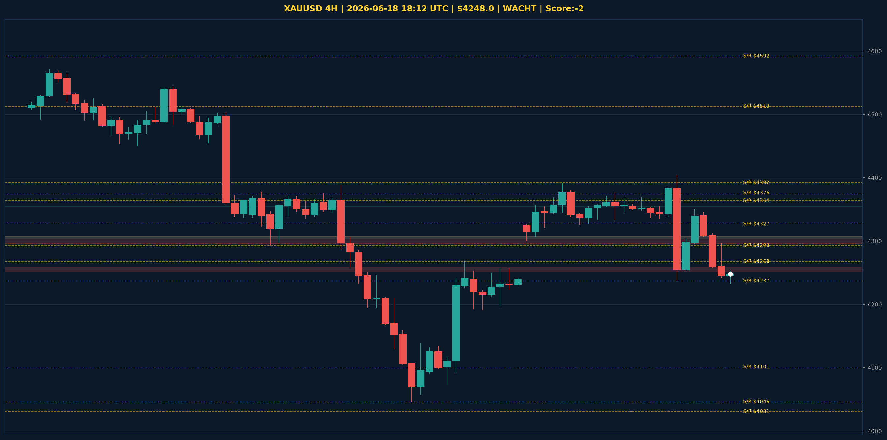

# XAUUSD Analyse - 2026-06-18 18:12 UTC

> Prijs: $4248.0 | Beslissing: WACHT | Score: -2

---

## Grafiek

---

## Trend

| TF | Trend |
|---|---|
| Weekly | NEUTRAAL |
| Daily | BEARISH |
| 4H | BULLISH |

## S/R

Daily: [4031.0, 4101.0, 4364.0, 4513.0, 4592.0, 4765.0, 4851.0, 4880.0]
4H: [4046.0, 4237.0, 4268.0, 4293.0, 4327.0, 4376.0, 4392.0]

## FVGs

Bullish 4H: [{'low': 4354.0, 'high': 4354.0}, {'low': 4303.0, 'high': 4307.0}]
Bearish 4H: [{'low': 4296.0, 'high': 4307.0}, {'low': 4252.0, 'high': 4258.0}]

## Fibonacci

Swing: $4031.0 - $5405.0
Fib 50%: $4718.0 | Fib 61.8%: $4556.0

*MVR Trading Agent | 2026-06-18 18:12 UTC*
