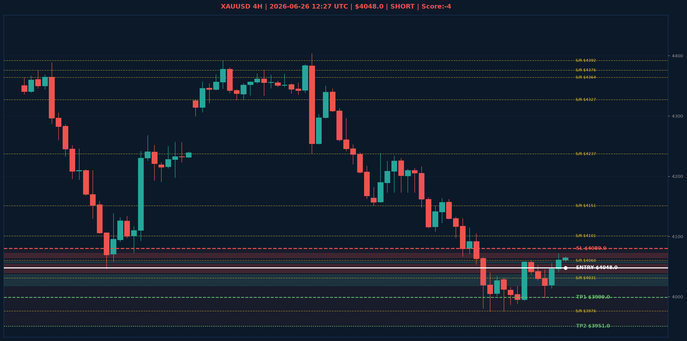

# XAUUSD Analyse - 2026-06-26 12:27 UTC

> Prijs: $4048.0 | Beslissing: SHORT | Score: -4

---

## Grafiek

---

## Trend

| TF | Trend |
|---|---|
| Weekly | NEUTRAAL |
| Daily | BEARISH |
| 4H | NEUTRAAL |

## S/R

Daily: [4031.0, 4101.0, 4364.0, 4513.0, 4592.0, 4765.0, 4880.0]
4H: [3976.0, 4060.0, 4151.0, 4237.0, 4327.0, 4376.0, 4392.0]

## FVGs

Bullish 4H: [{'low': 4018.0, 'high': 4037.0}, {'low': 4056.0, 'high': 4058.0}]
Bearish 4H: [{'low': 4065.0, 'high': 4072.0}, {'low': 4040.0, 'high': 4054.0}]

## Fibonacci

Swing: $3963.0 - $5405.0
Fib 50%: $4684.0 | Fib 61.8%: $4514.0

## Trade Setup

| | |
|---|---|
| Entry | $4048.0 |
| Stop Loss | $4080.0 |
| TP1 | $3999.0 |
| TP2 | $3951.0 |

*MVR Trading Agent | 2026-06-26 12:27 UTC*
