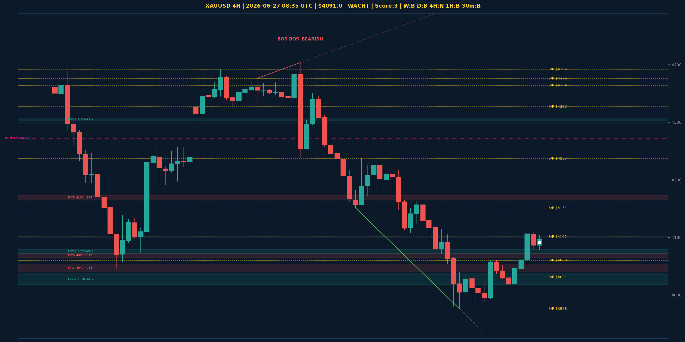

# XAUUSD Top-Down Analyse - 2026-06-27 08:35 UTC

> Prijs: $4091.0 | Beslissing: WACHT | Score: 3

---

## Grafiek

---

## Top-Down Trend

| TF | Trend |
|---|---|
| Weekly | BULLISH |
| Daily | BEARISH |
| 4H | NEUTRAAL |
| 1H | BULLISH |
| 30min | BULLISH |

## Fibonacci (swing $3963.0 - $5405.0)

| Level | Prijs |
|---|---|
| 23.6% | $5065.0 |
| 38.2% | $4854.0 |
| 50.0% | $4684.0 |
| 61.8% | $4514.0 |
| 78.6% | $4272.0 |

## Structuur

- **BOS 4H:** BOS_BEARISH
- **BOS 1H:** BOS_BULLISH
- **Pin bar 1H:** geen
- **Pin bar 30min:** HAMMER@$4079.0

## FVGs

Bullish 4H: [{'low': 4303.0, 'high': 4307.0}, {'low': 4018.0, 'high': 4037.0}, {'low': 4072.0, 'high': 4079.0}]
Bearish 4H: [{'low': 4165.0, 'high': 4173.0}, {'low': 4065.0, 'high': 4072.0}, {'low': 4040.0, 'high': 4054.0}]

## S/R

Daily: [4031.0, 4101.0, 4364.0, 4513.0, 4592.0, 4765.0, 4880.0]
4H: [3976.0, 4060.0, 4151.0, 4237.0, 4327.0, 4376.0, 4392.0]
1H: [3976.0, 3989.0, 4018.0, 4034.0, 4060.0, 4112.0]

*MVR Trading Agent | 2026-06-27 08:35 UTC*
