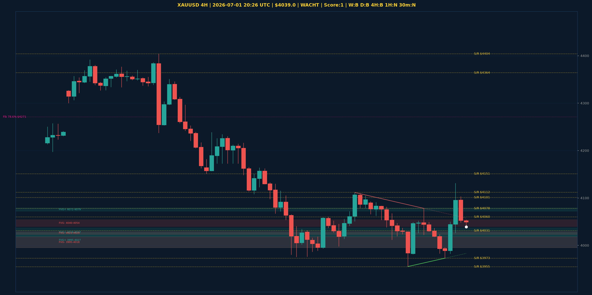

# XAUUSD Top-Down Analyse - 2026-07-01 20:26 UTC

> Prijs: $4039.0 | Beslissing: WACHT | Score: 1

---

## Grafiek

---

## Top-Down Trend

| TF | Trend |
|---|---|
| Weekly | BULLISH |
| Daily | BEARISH |
| 4H | BEARISH |
| 1H | NEUTRAAL |
| 30min | NEUTRAAL |

## Fibonacci (swing $3962.0 - $5405.0)

| Level | Prijs |
|---|---|
| 23.6% | $5065.0 |
| 38.2% | $4854.0 |
| 50.0% | $4684.0 |
| 61.8% | $4514.0 |
| 78.6% | $4271.0 |

## Structuur

- **BOS 4H:** geen
- **BOS 1H:** geen
- **Pin bar 1H:** geen
- **Pin bar 30min:** geen

## Economic Calendar (USD vandaag)

- 🟡 **18:15 CEST** — ADP Non-Farm Employment Change (prev: 122K, fore: 118K)
- 🔴 **19:00 CEST** — Fed Chairman Warsh Speaks (prev: , fore: )
- 🔴 **20:00 CEST** — ISM Manufacturing PMI (prev: 54.0, fore: 53.8)
- 🟡 **20:00 CEST** — ISM Manufacturing Prices (prev: 82.1, fore: 77.7)
- 🟡 **01:15 CEST** — President Trump Speaks (prev: , fore: )

## FVGs

Bullish 4H: [{'low': 4018.0, 'high': 4037.0}, {'low': 4072.0, 'high': 4079.0}, {'low': 3995.0, 'high': 4027.0}]
Bearish 4H: [{'low': 4040.0, 'high': 4054.0}, {'low': 4023.0, 'high': 4029.0}, {'low': 3995.0, 'high': 4018.0}]

## S/R

Daily: [4031.0, 4101.0, 4364.0, 4513.0, 4592.0, 4765.0, 4880.0]
4H: [3955.0, 3973.0, 4060.0, 4078.0, 4112.0, 4151.0, 4404.0]
1H: [3955.0, 3973.0, 4019.0, 4037.0, 4052.0, 4078.0, 4131.0]

*MVR Trading Agent | 2026-07-01 20:26 UTC*
