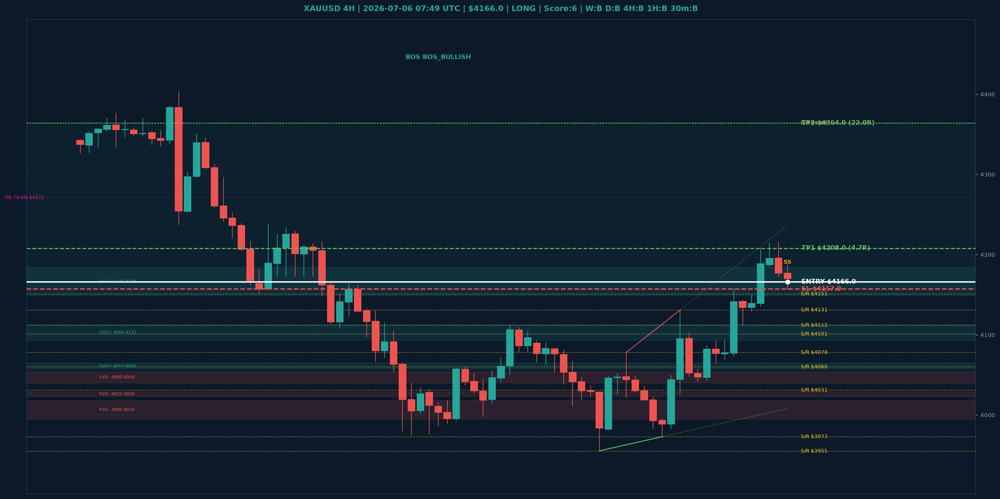

# XAUUSD Top-Down Analyse - 2026-07-06 07:49 UTC

> Prijs: $4166.0 | Beslissing: LONG | Score: 6

---

## Grafiek

---

## Top-Down Trend

| TF | Trend |
|---|---|
| Weekly | BULLISH |
| Daily | BEARISH |
| 4H | BULLISH |
| 1H | BULLISH |
| 30min | BULLISH |

## Fibonacci (swing $3962.0 - $5405.0)

| Level | Prijs |
|---|---|
| 23.6% | $5065.0 |
| 38.2% | $4854.0 |
| 50.0% | $4684.0 |
| 61.8% | $4514.0 |
| 78.6% | $4271.0 |

## Structuur

- **BOS 4H:** BOS_BULLISH
- **BOS 1H:** BOS_BULLISH
- **Pin bar 1H:** SHOOTING_STAR@$4187.0
- **Pin bar 30min:** SHOOTING_STAR@$4187.0, SHOOTING_STAR@$4187.0, SHOOTING_STAR@$4187.0, SHOOTING_STAR@$4187.0, SHOOTING_STAR@$4187.0

## Economic Calendar (USD vandaag)

- 🔴 **20:00 CEST** — ISM Services PMI (prev: 54.5, fore: 54.2)

## FVGs

Bullish 4H: [{'low': 4057.0, 'high': 4065.0}, {'low': 4093.0, 'high': 4113.0}, {'low': 4149.0, 'high': 4184.0}]
Bearish 4H: [{'low': 4040.0, 'high': 4054.0}, {'low': 4023.0, 'high': 4029.0}, {'low': 3995.0, 'high': 4018.0}]

## S/R

Daily: [4031.0, 4101.0, 4364.0, 4513.0, 4592.0, 4765.0, 4880.0]
4H: [3955.0, 3973.0, 4060.0, 4078.0, 4112.0, 4131.0, 4151.0]
1H: [3973.0, 4042.0, 4070.0, 4093.0, 4113.0, 4157.0, 4208.0]

## Trade Setup

| | |
|---|---|
| Entry | $4166.0 |
| Stop Loss | $4157.0 |
| TP1 | $4208.0 (4.7R) |
| TP2 | $4364.0 (22.0R) |

*MVR Trading Agent | 2026-07-06 07:49 UTC*
