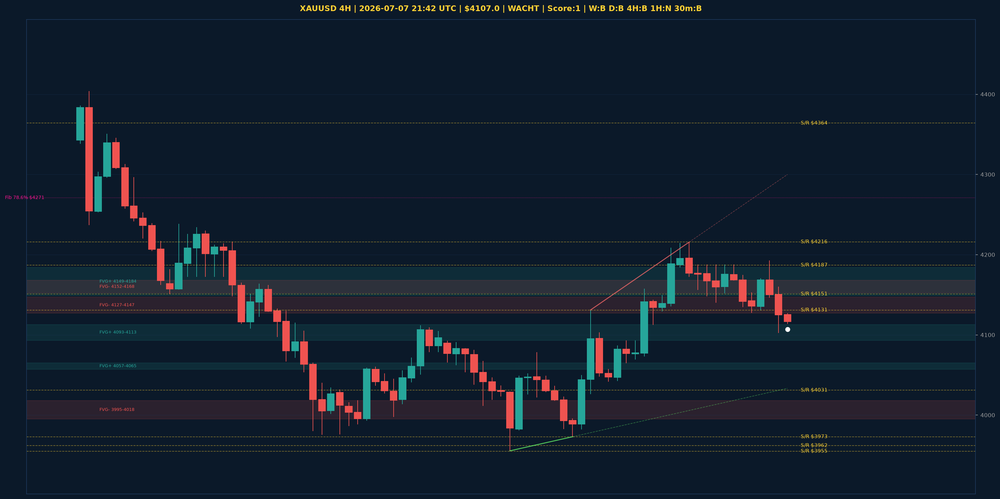

# XAUUSD Top-Down Analyse - 2026-07-07 21:42 UTC

> Prijs: $4107.0 | Beslissing: WACHT | Score: 1

---

## Grafiek

---

## Top-Down Trend

| TF | Trend |
|---|---|
| Weekly | BULLISH |
| Daily | BEARISH |
| 4H | BULLISH |
| 1H | NEUTRAAL |
| 30min | BULLISH |

## Fibonacci (swing $3962.0 - $5405.0)

| Level | Prijs |
|---|---|
| 23.6% | $5065.0 |
| 38.2% | $4854.0 |
| 50.0% | $4684.0 |
| 61.8% | $4514.0 |
| 78.6% | $4271.0 |

## Structuur

- **BOS 4H:** geen
- **BOS 1H:** BOS_BEARISH
- **Pin bar 1H:** geen
- **Pin bar 30min:** geen

## FVGs

Bullish 4H: [{'low': 4057.0, 'high': 4065.0}, {'low': 4093.0, 'high': 4113.0}, {'low': 4149.0, 'high': 4184.0}]
Bearish 4H: [{'low': 3995.0, 'high': 4018.0}, {'low': 4152.0, 'high': 4168.0}, {'low': 4127.0, 'high': 4147.0}]

## S/R

Daily: [3962.0, 4031.0, 4364.0, 4513.0, 4592.0, 4765.0, 4880.0]
4H: [3955.0, 3973.0, 4131.0, 4151.0, 4187.0, 4216.0]
1H: [4128.0, 4141.0, 4156.0, 4187.0]

*MVR Trading Agent | 2026-07-07 21:42 UTC*
