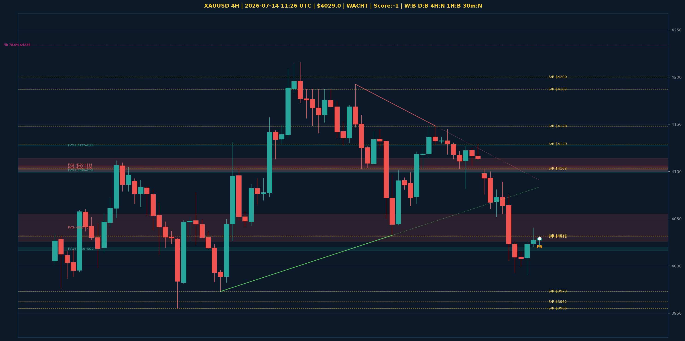

# XAUUSD Top-Down Analyse - 2026-07-14 11:26 UTC

> Prijs: $4029.0 | Beslissing: WACHT | Score: -1

---

## Grafiek

---

## Top-Down Trend

| TF | Trend |
|---|---|
| Weekly | BULLISH |
| Daily | BEARISH |
| 4H | NEUTRAAL |
| 1H | BEARISH |
| 30min | NEUTRAAL |
| 5min | NEUTRAAL |

## Fibonacci (swing $3962.0 - $5230.0)

| Level | Prijs |
|---|---|
| 23.6% | $4931.0 |
| 38.2% | $4746.0 |
| 50.0% | $4596.0 |
| 61.8% | $4447.0 |
| 78.6% | $4234.0 |

## Structuur

- **BOS 4H:** geen
- **BOS 1H:** geen
- **Pin bar 1H:** HAMMER@$4022.0, HAMMER@$4022.0
- **Pin bar 30min:** SHOOTING_STAR@$4031.0, HAMMER@$4022.0

## Economic Calendar (USD vandaag)

- 🔴 **18:30 CEST** — Core CPI m/m (prev: 0.2%, fore: 0.2%)
- 🔴 **18:30 CEST** — Core CPI y/y (prev: 2.9%, fore: 2.8%)
- 🔴 **18:30 CEST** — CPI m/m (prev: 0.5%, fore: -0.1%)
- 🔴 **18:30 CEST** — CPI y/y (prev: 4.2%, fore: 3.8%)
- 🔴 **20:00 CEST** — Fed Chairman Warsh Testifies (prev: , fore: )

## FVGs

Bullish 4H: [{'low': 4099.0, 'high': 4103.0}, {'low': 4127.0, 'high': 4128.0}, {'low': 4016.0, 'high': 4020.0}]
Bearish 4H: [{'low': 4102.0, 'high': 4106.0}, {'low': 4100.0, 'high': 4114.0}, {'low': 4026.0, 'high': 4055.0}]

## S/R

Daily: [3962.0, 4031.0, 4200.0, 4364.0, 4513.0, 4592.0, 4765.0]
4H: [3955.0, 3973.0, 4032.0, 4103.0, 4129.0, 4148.0, 4187.0]
1H: [3990.0, 4040.0, 4082.0, 4125.0]

*MVR Trading Agent | 2026-07-14 11:26 UTC*
