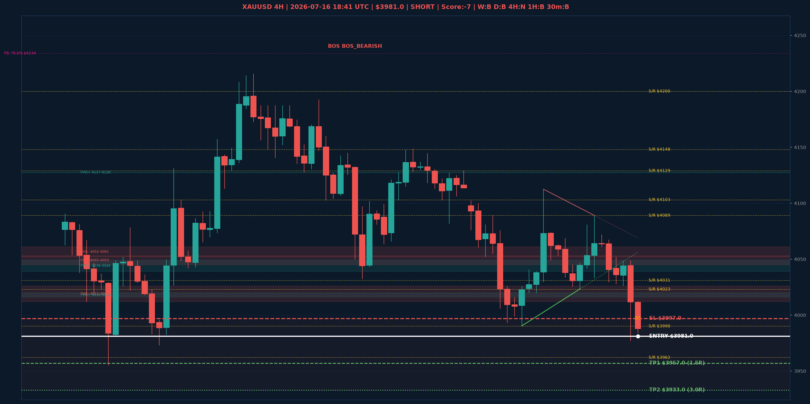

# XAUUSD Top-Down Analyse - 2026-07-16 18:41 UTC

> Prijs: $3981.0 | Beslissing: SHORT | Score: -7

---

## Grafiek

---

## Top-Down Trend

| TF | Trend |
|---|---|
| Weekly | BULLISH |
| Daily | BEARISH |
| 4H | NEUTRAAL |
| 1H | BEARISH |
| 30min | BEARISH |
| 5min | BEARISH |

## Fibonacci (swing $3962.0 - $5230.0)

| Level | Prijs |
|---|---|
| 23.6% | $4931.0 |
| 38.2% | $4746.0 |
| 50.0% | $4596.0 |
| 61.8% | $4447.0 |
| 78.6% | $4234.0 |

## Structuur

- **BOS 4H:** BOS_BEARISH
- **BOS 1H:** BOS_BEARISH
- **Pin bar 1H:** SHOOTING_STAR@$3995.0
- **Pin bar 30min:** geen

## Economic Calendar (USD vandaag)

- 🟡 **18:30 CEST** — Core Retail Sales m/m (prev: 0.8%, fore: 0.0%)
- 🟡 **18:30 CEST** — Philly Fed Manufacturing Index (prev: 10.3, fore: 12.7)
- 🟡 **18:30 CEST** — Retail Sales m/m (prev: 0.9%, fore: 0.2%)
- 🟡 **18:30 CEST** — Unemployment Claims (prev: 215K, fore: 216K)

## FVGs

Bullish 4H: [{'low': 4127.0, 'high': 4128.0}, {'low': 4016.0, 'high': 4020.0}, {'low': 4039.0, 'high': 4049.0}]
Bearish 4H: [{'low': 4045.0, 'high': 4053.0}, {'low': 4052.0, 'high': 4061.0}, {'low': 4012.0, 'high': 4026.0}]

## S/R

Daily: [3962.0, 4031.0, 4200.0, 4364.0, 4513.0, 4592.0, 4765.0]
4H: [3990.0, 4023.0, 4089.0, 4103.0, 4129.0, 4148.0]
1H: [3977.0, 4028.0, 4049.0, 4081.0]

## Trade Setup

| | |
|---|---|
| Entry | $3981.0 |
| Stop Loss | $3997.0 |
| TP1 | $3957.0 (1.5R) |
| TP2 | $3933.0 (3.0R) |

*MVR Trading Agent | 2026-07-16 18:41 UTC*
