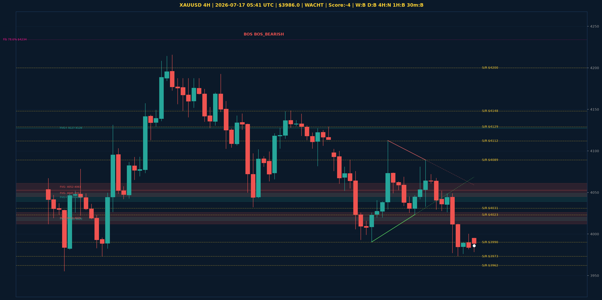

# XAUUSD Top-Down Analyse - 2026-07-17 05:41 UTC

> Prijs: $3986.0 | Beslissing: WACHT | Score: -4

---

## Grafiek

---

## Top-Down Trend

| TF | Trend |
|---|---|
| Weekly | BULLISH |
| Daily | BEARISH |
| 4H | NEUTRAAL |
| 1H | BEARISH |
| 30min | BEARISH |
| 5min | NEUTRAAL |

## Fibonacci (swing $3962.0 - $5230.0)

| Level | Prijs |
|---|---|
| 23.6% | $4931.0 |
| 38.2% | $4746.0 |
| 50.0% | $4596.0 |
| 61.8% | $4447.0 |
| 78.6% | $4234.0 |

## Structuur

- **BOS 4H:** BOS_BEARISH
- **BOS 1H:** geen
- **Pin bar 1H:** geen
- **Pin bar 30min:** geen

## Economic Calendar (USD vandaag)

- 🟡 **07:00 CEST** — President Trump Speaks (prev: , fore: )
- 🟡 **20:00 CEST** — Prelim UoM Consumer Sentiment (prev: 48.9, fore: 51.0)
- 🟡 **20:00 CEST** — Prelim UoM Inflation Expectations (prev: 4.6%, fore: )

## FVGs

Bullish 4H: [{'low': 4127.0, 'high': 4128.0}, {'low': 4016.0, 'high': 4020.0}, {'low': 4039.0, 'high': 4049.0}]
Bearish 4H: [{'low': 4045.0, 'high': 4053.0}, {'low': 4052.0, 'high': 4061.0}, {'low': 4012.0, 'high': 4026.0}]

## S/R

Daily: [3962.0, 4031.0, 4200.0, 4364.0, 4513.0, 4592.0, 4765.0]
4H: [3973.0, 3990.0, 4023.0, 4089.0, 4112.0, 4129.0, 4148.0]
1H: [3973.0, 4000.0, 4028.0, 4049.0, 4089.0]

*MVR Trading Agent | 2026-07-17 05:41 UTC*
