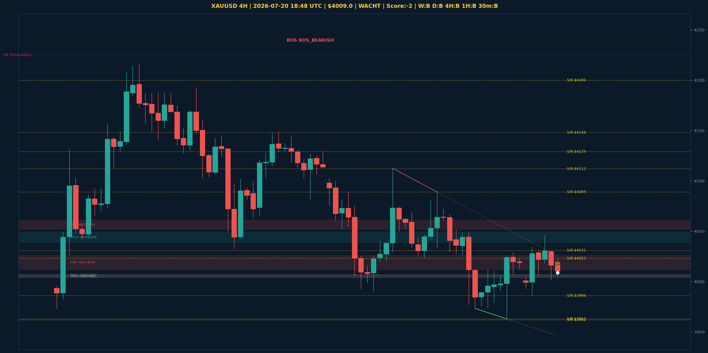

# XAUUSD Top-Down Analyse - 2026-07-20 18:48 UTC

> Prijs: $4009.0 | Beslissing: WACHT | Score: -2

---

## Grafiek

---

## Top-Down Trend

| TF | Trend |
|---|---|
| Weekly | BULLISH |
| Daily | BEARISH |
| 4H | BEARISH |
| 1H | BULLISH |
| 30min | BEARISH |
| 5min | NEUTRAAL |

## Fibonacci (swing $3962.0 - $5191.0)

| Level | Prijs |
|---|---|
| 23.6% | $4901.0 |
| 38.2% | $4722.0 |
| 50.0% | $4577.0 |
| 61.8% | $4432.0 |
| 78.6% | $4225.0 |

## Structuur

- **BOS 4H:** BOS_BEARISH
- **BOS 1H:** geen
- **Pin bar 1H:** SHOOTING_STAR@$4016.0
- **Pin bar 30min:** HAMMER@$4005.0, SHOOTING_STAR@$4016.0, HAMMER@$4008.0

## FVGs

Bullish 4H: [{'low': 4039.0, 'high': 4049.0}, {'low': 4006.0, 'high': 4007.0}, {'low': 4004.0, 'high': 4006.0}]
Bearish 4H: [{'low': 4052.0, 'high': 4061.0}, {'low': 4012.0, 'high': 4026.0}, {'low': 4004.0, 'high': 4007.0}]

## S/R

Daily: [3962.0, 4031.0, 4200.0, 4364.0, 4513.0, 4592.0, 4765.0]
4H: [3963.0, 3986.0, 4023.0, 4089.0, 4112.0, 4129.0, 4148.0]
1H: [3963.0, 3986.0, 4002.0, 4029.0, 4046.0]

*MVR Trading Agent | 2026-07-20 18:48 UTC*
