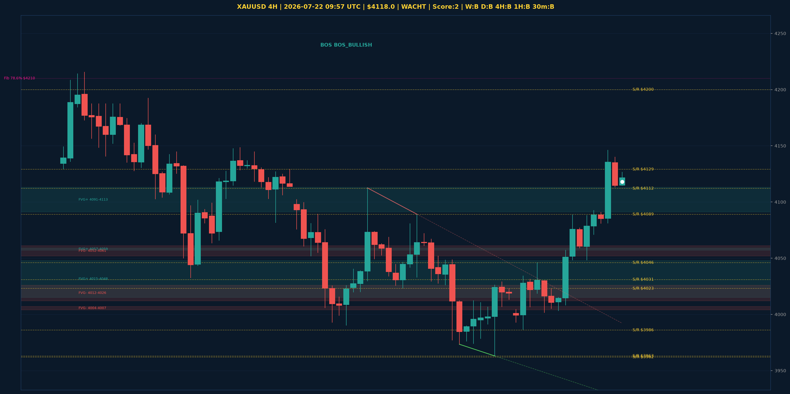

# XAUUSD Top-Down Analyse - 2026-07-22 09:57 UTC

> Prijs: $4118.0 | Beslissing: WACHT | Score: 2

---

## Grafiek

---

## Top-Down Trend

| TF | Trend |
|---|---|
| Weekly | BULLISH |
| Daily | BEARISH |
| 4H | BEARISH |
| 1H | BULLISH |
| 30min | BULLISH |
| 5min | NEUTRAAL |

## Fibonacci (swing $3962.0 - $5117.0)

| Level | Prijs |
|---|---|
| 23.6% | $4845.0 |
| 38.2% | $4676.0 |
| 50.0% | $4540.0 |
| 61.8% | $4404.0 |
| 78.6% | $4210.0 |

## Structuur

- **BOS 4H:** BOS_BULLISH
- **BOS 1H:** BOS_BULLISH
- **Pin bar 1H:** geen
- **Pin bar 30min:** HAMMER@$4118.0, SHOOTING_STAR@$4127.0

## Economic Calendar (USD vandaag)

- 🟡 **01:00 CEST** — President Trump Speaks (prev: , fore: )

## FVGs

Bullish 4H: [{'low': 4015.0, 'high': 4048.0}, {'low': 4057.0, 'high': 4059.0}, {'low': 4091.0, 'high': 4113.0}]
Bearish 4H: [{'low': 4052.0, 'high': 4061.0}, {'low': 4012.0, 'high': 4026.0}, {'low': 4004.0, 'high': 4007.0}]

## S/R

Daily: [3962.0, 4031.0, 4200.0, 4364.0, 4513.0, 4592.0, 4765.0]
4H: [3963.0, 3986.0, 4023.0, 4046.0, 4089.0, 4112.0, 4129.0]
1H: [4002.0, 4046.0, 4088.0, 4146.0]

*MVR Trading Agent | 2026-07-22 09:57 UTC*
