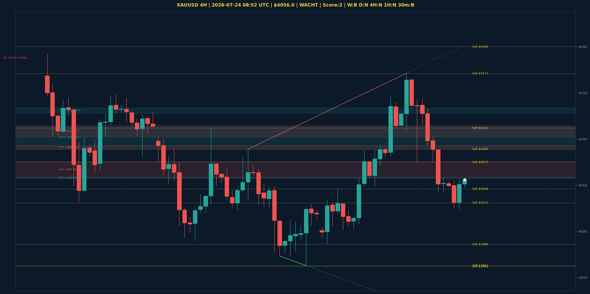

# XAUUSD Top-Down Analyse - 2026-07-24 08:52 UTC

> Prijs: $4056.0 | Beslissing: WACHT | Score: 2

---

## Grafiek

---

## Top-Down Trend

| TF | Trend |
|---|---|
| Weekly | BULLISH |
| Daily | NEUTRAAL |
| 4H | NEUTRAAL |
| 1H | NEUTRAAL |
| 30min | BEARISH |
| 5min | BULLISH |

## Fibonacci (swing $3962.0 - $5018.0)

| Level | Prijs |
|---|---|
| 23.6% | $4769.0 |
| 38.2% | $4615.0 |
| 50.0% | $4490.0 |
| 61.8% | $4366.0 |
| 78.6% | $4188.0 |

## Structuur

- **BOS 4H:** geen
- **BOS 1H:** geen
- **Pin bar 1H:** geen
- **Pin bar 30min:** geen

## FVGs

Bullish 4H: [{'low': 4057.0, 'high': 4059.0}, {'low': 4091.0, 'high': 4113.0}, {'low': 4128.0, 'high': 4134.0}]
Bearish 4H: [{'low': 4102.0, 'high': 4115.0}, {'low': 4089.0, 'high': 4093.0}, {'low': 4058.0, 'high': 4076.0}]

## S/R

Daily: [3962.0, 4031.0, 4200.0, 4364.0, 4592.0, 4765.0]
4H: [3963.0, 3986.0, 4046.0, 4075.0, 4089.0, 4112.0, 4171.0]
1H: [4024.0, 4042.0, 4115.0, 4144.0, 4171.0]

*MVR Trading Agent | 2026-07-24 08:52 UTC*
