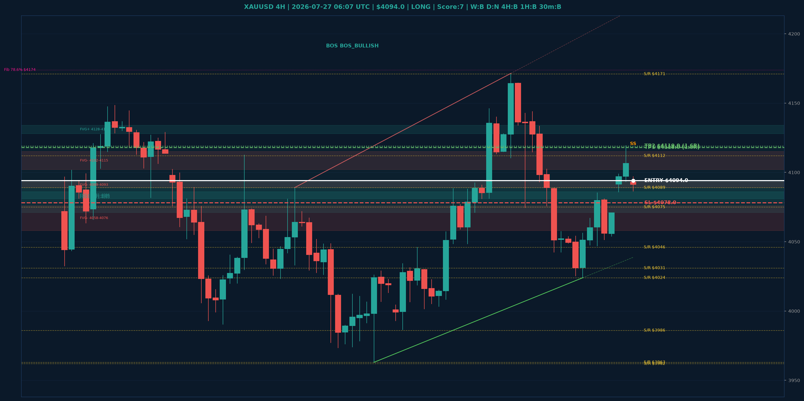

# XAUUSD Top-Down Analyse - 2026-07-27 06:07 UTC

> Prijs: $4094.0 | Beslissing: LONG | Score: 7

---

## Grafiek

---

## Top-Down Trend

| TF | Trend |
|---|---|
| Weekly | BULLISH |
| Daily | NEUTRAAL |
| 4H | BULLISH |
| 1H | BULLISH |
| 30min | BULLISH |
| 5min | NEUTRAAL |

## Fibonacci (swing $3962.0 - $4950.0)

| Level | Prijs |
|---|---|
| 23.6% | $4717.0 |
| 38.2% | $4573.0 |
| 50.0% | $4456.0 |
| 61.8% | $4340.0 |
| 78.6% | $4174.0 |

## Structuur

- **BOS 4H:** BOS_BULLISH
- **BOS 1H:** BOS_BULLISH
- **Pin bar 1H:** SHOOTING_STAR@$4119.0
- **Pin bar 30min:** SHOOTING_STAR@$4094.0

## FVGs

Bullish 4H: [{'low': 4128.0, 'high': 4134.0}, {'low': 4081.0, 'high': 4086.0}, {'low': 4071.0, 'high': 4093.0}]
Bearish 4H: [{'low': 4102.0, 'high': 4115.0}, {'low': 4089.0, 'high': 4093.0}, {'low': 4058.0, 'high': 4076.0}]

## S/R

Daily: [3962.0, 4031.0, 4200.0, 4364.0, 4592.0, 4765.0]
4H: [3963.0, 3986.0, 4024.0, 4046.0, 4075.0, 4089.0, 4112.0, 4171.0]
1H: [4024.0, 4042.0, 4085.0, 4119.0, 4144.0]

## Trade Setup

| | |
|---|---|
| Entry | $4094.0 |
| Stop Loss | $4078.0 |
| TP1 | $4118.0 (1.5R) |
| TP2 | $4119.0 (1.6R) |

*MVR Trading Agent | 2026-07-27 06:07 UTC*
