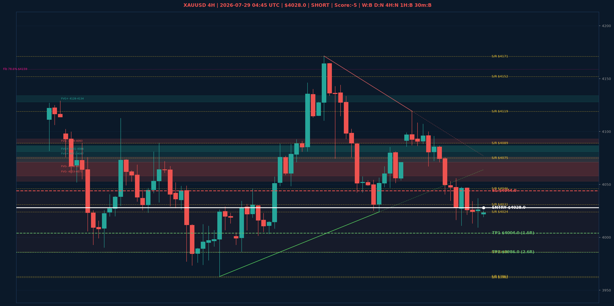

# XAUUSD Top-Down Analyse - 2026-07-29 04:45 UTC

> Prijs: $4028.0 | Beslissing: SHORT | Score: -5

---

## Grafiek

---

## Top-Down Trend

| TF | Trend |
|---|---|
| Weekly | BULLISH |
| Daily | NEUTRAAL |
| 4H | NEUTRAAL |
| 1H | BEARISH |
| 30min | BEARISH |
| 5min | NEUTRAAL |

## Fibonacci (swing $3962.0 - $4880.0)

| Level | Prijs |
|---|---|
| 23.6% | $4663.0 |
| 38.2% | $4529.0 |
| 50.0% | $4421.0 |
| 61.8% | $4313.0 |
| 78.6% | $4159.0 |

## Structuur

- **BOS 4H:** geen
- **BOS 1H:** BOS_BEARISH
- **Pin bar 1H:** geen
- **Pin bar 30min:** geen

## Economic Calendar (USD vandaag)

- 🔴 **00:00 CEST** — Federal Funds Rate (prev: 3.75%, fore: 3.75%)
- 🔴 **00:00 CEST** — FOMC Statement (prev: , fore: )
- 🔴 **00:30 CEST** — FOMC Press Conference (prev: , fore: )

## FVGs

Bullish 4H: [{'low': 4128.0, 'high': 4134.0}, {'low': 4081.0, 'high': 4086.0}, {'low': 4071.0, 'high': 4087.0}]
Bearish 4H: [{'low': 4089.0, 'high': 4093.0}, {'low': 4058.0, 'high': 4076.0}, {'low': 4053.0, 'high': 4071.0}]

## S/R

Daily: [3962.0, 4031.0, 4152.0, 4200.0, 4364.0, 4592.0]
4H: [3963.0, 3986.0, 4024.0, 4046.0, 4075.0, 4089.0, 4119.0, 4171.0]
1H: [4009.0, 4035.0, 4056.0, 4096.0]

## Trade Setup

| | |
|---|---|
| Entry | $4028.0 |
| Stop Loss | $4044.0 |
| TP1 | $4004.0 (1.5R) |
| TP2 | $3986.0 (2.6R) |

*MVR Trading Agent | 2026-07-29 04:45 UTC*
