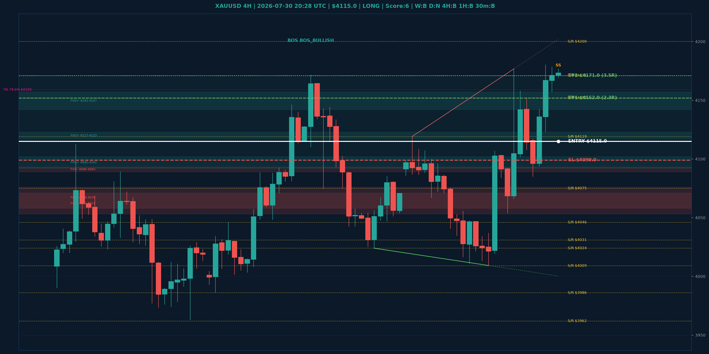

# XAUUSD Top-Down Analyse - 2026-07-30 20:28 UTC

> Prijs: $4115.0 | Beslissing: LONG | Score: 6

---

## Grafiek

---

## Top-Down Trend

| TF | Trend |
|---|---|
| Weekly | BULLISH |
| Daily | NEUTRAAL |
| 4H | BEARISH |
| 1H | BULLISH |
| 30min | BULLISH |
| 5min | NEUTRAAL |

## Fibonacci (swing $3962.0 - $4880.0)

| Level | Prijs |
|---|---|
| 23.6% | $4663.0 |
| 38.2% | $4529.0 |
| 50.0% | $4421.0 |
| 61.8% | $4313.0 |
| 78.6% | $4159.0 |

## Structuur

- **BOS 4H:** BOS_BULLISH
- **BOS 1H:** geen
- **Pin bar 1H:** SHOOTING_STAR@$4178.0
- **Pin bar 30min:** geen

## Economic Calendar (USD vandaag)

- 🔴 **18:30 CEST** — Advance GDP q/q (prev: 2.0%, fore: 2.1%)
- 🔴 **18:30 CEST** — Core PCE Price Index m/m (prev: 0.3%, fore: 0.2%)
- 🟡 **18:30 CEST** — Advance GDP Price Index q/q (prev: 3.6%, fore: 4.1%)
- 🟡 **18:30 CEST** — Unemployment Claims (prev: 187K, fore: 201K)

## FVGs

Bullish 4H: [{'low': 4092.0, 'high': 4102.0}, {'low': 4117.0, 'high': 4123.0}, {'low': 4142.0, 'high': 4157.0}]
Bearish 4H: [{'low': 4089.0, 'high': 4093.0}, {'low': 4058.0, 'high': 4076.0}, {'low': 4053.0, 'high': 4071.0}]

## S/R

Daily: [3962.0, 4031.0, 4152.0, 4200.0, 4364.0, 4592.0]
4H: [3986.0, 4009.0, 4024.0, 4046.0, 4075.0, 4119.0, 4171.0]
1H: [4009.0, 4047.0, 4085.0, 4107.0, 4177.0]

## Trade Setup

| | |
|---|---|
| Entry | $4115.0 |
| Stop Loss | $4099.0 |
| TP1 | $4152.0 (2.3R) |
| TP2 | $4171.0 (3.5R) |

*MVR Trading Agent | 2026-07-30 20:28 UTC*
