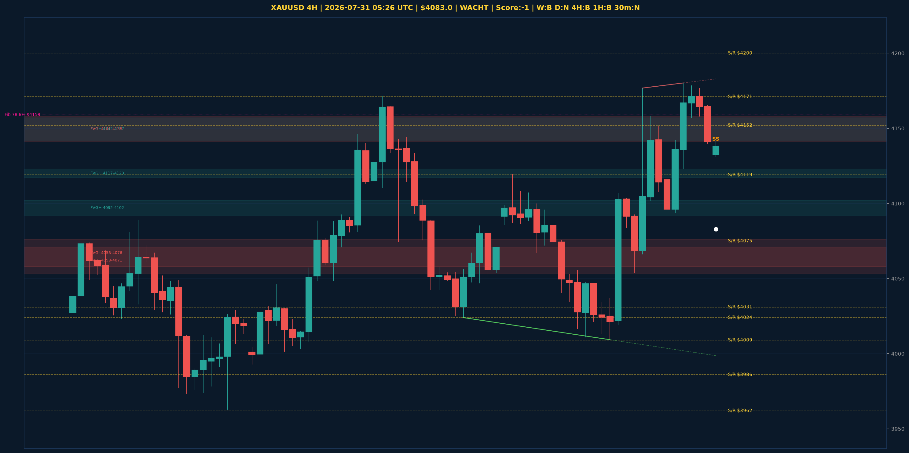

# XAUUSD Top-Down Analyse - 2026-07-31 05:26 UTC

> Prijs: $4083.0 | Beslissing: WACHT | Score: -1

---

## Grafiek

---

## Top-Down Trend

| TF | Trend |
|---|---|
| Weekly | BULLISH |
| Daily | NEUTRAAL |
| 4H | BEARISH |
| 1H | BULLISH |
| 30min | NEUTRAAL |
| 5min | NEUTRAAL |

## Fibonacci (swing $3962.0 - $4880.0)

| Level | Prijs |
|---|---|
| 23.6% | $4663.0 |
| 38.2% | $4529.0 |
| 50.0% | $4421.0 |
| 61.8% | $4313.0 |
| 78.6% | $4159.0 |

## Structuur

- **BOS 4H:** geen
- **BOS 1H:** geen
- **Pin bar 1H:** SHOOTING_STAR@$4141.0
- **Pin bar 30min:** HAMMER@$4132.0, SHOOTING_STAR@$4141.0

## Economic Calendar (USD vandaag)

- 🟡 **18:30 CEST** — Employment Cost Index q/q (prev: 0.9%, fore: 0.8%)
- 🟡 **20:00 CEST** — Revised UoM Consumer Sentiment (prev: 54.4, fore: 53.9)
- 🟡 **20:00 CEST** — Revised UoM Inflation Expectations (prev: 4.2%, fore: )

## FVGs

Bullish 4H: [{'low': 4092.0, 'high': 4102.0}, {'low': 4117.0, 'high': 4123.0}, {'low': 4142.0, 'high': 4157.0}]
Bearish 4H: [{'low': 4058.0, 'high': 4076.0}, {'low': 4053.0, 'high': 4071.0}, {'low': 4141.0, 'high': 4158.0}]

## S/R

Daily: [3962.0, 4031.0, 4152.0, 4200.0, 4364.0, 4592.0]
4H: [3986.0, 4009.0, 4024.0, 4075.0, 4119.0, 4171.0]
1H: [4009.0, 4054.0, 4085.0, 4107.0, 4177.0]

*MVR Trading Agent | 2026-07-31 05:26 UTC*
