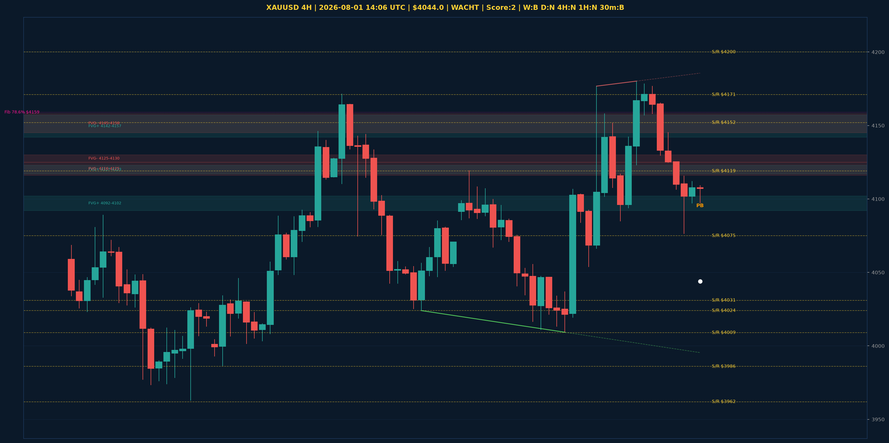

# XAUUSD Top-Down Analyse - 2026-08-01 14:06 UTC

> Prijs: $4044.0 | Beslissing: WACHT | Score: 2

---

## Grafiek

---

## Top-Down Trend

| TF | Trend |
|---|---|
| Weekly | BULLISH |
| Daily | NEUTRAAL |
| 4H | NEUTRAAL |
| 1H | NEUTRAAL |
| 30min | BEARISH |
| 5min | NEUTRAAL |

## Fibonacci (swing $3962.0 - $4880.0)

| Level | Prijs |
|---|---|
| 23.6% | $4663.0 |
| 38.2% | $4529.0 |
| 50.0% | $4421.0 |
| 61.8% | $4313.0 |
| 78.6% | $4159.0 |

## Structuur

- **BOS 4H:** geen
- **BOS 1H:** geen
- **Pin bar 1H:** HAMMER@$4097.0
- **Pin bar 30min:** HAMMER@$4104.0

## FVGs

Bullish 4H: [{'low': 4092.0, 'high': 4102.0}, {'low': 4117.0, 'high': 4123.0}, {'low': 4142.0, 'high': 4157.0}]
Bearish 4H: [{'low': 4145.0, 'high': 4158.0}, {'low': 4125.0, 'high': 4130.0}, {'low': 4116.0, 'high': 4125.0}]

## S/R

Daily: [3962.0, 4031.0, 4152.0, 4200.0, 4364.0, 4592.0]
4H: [3986.0, 4009.0, 4024.0, 4075.0, 4119.0, 4171.0]
1H: [4054.0, 4076.0, 4130.0, 4145.0, 4177.0]

*MVR Trading Agent | 2026-08-01 14:06 UTC*
