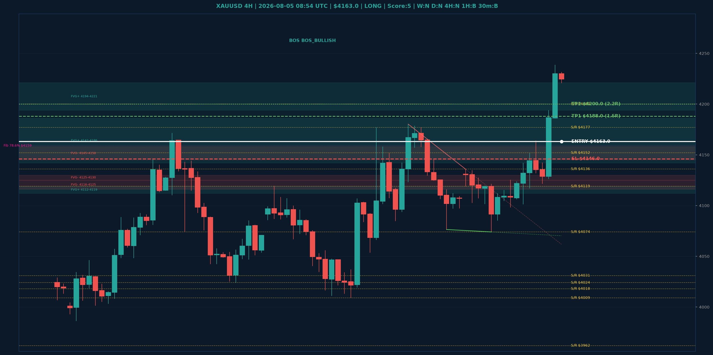

# XAUUSD Top-Down Analyse - 2026-08-05 08:54 UTC

> Prijs: $4163.0 | Beslissing: LONG | Score: 5

---

## Grafiek

---

## Top-Down Trend

| TF | Trend |
|---|---|
| Weekly | NEUTRAAL |
| Daily | NEUTRAAL |
| 4H | NEUTRAAL |
| 1H | BULLISH |
| 30min | BULLISH |
| 5min | NEUTRAAL |

## Fibonacci (swing $3962.0 - $4880.0)

| Level | Prijs |
|---|---|
| 23.6% | $4663.0 |
| 38.2% | $4529.0 |
| 50.0% | $4421.0 |
| 61.8% | $4313.0 |
| 78.6% | $4159.0 |

## Structuur

- **BOS 4H:** BOS_BULLISH
- **BOS 1H:** BOS_BULLISH
- **Pin bar 1H:** geen
- **Pin bar 30min:** geen

## Economic Calendar (USD vandaag)

- 🟡 **02:30 CEST** — President Trump Speaks (prev: , fore: )
- 🟡 **18:15 CEST** — ADP Non-Farm Employment Change (prev: 98K, fore: 68K)
- 🟡 **20:00 CEST** — ISM Services PMI (prev: 54.0, fore: 54.5)

## FVGs

Bullish 4H: [{'low': 4112.0, 'high': 4119.0}, {'low': 4142.0, 'high': 4186.0}, {'low': 4194.0, 'high': 4221.0}]
Bearish 4H: [{'low': 4145.0, 'high': 4158.0}, {'low': 4125.0, 'high': 4130.0}, {'low': 4116.0, 'high': 4125.0}]

## S/R

Daily: [3962.0, 4018.0, 4031.0, 4152.0, 4200.0, 4377.0, 4592.0]
4H: [4009.0, 4024.0, 4074.0, 4119.0, 4136.0, 4177.0]
1H: [4085.0, 4098.0, 4121.0, 4152.0]

## Trade Setup

| | |
|---|---|
| Entry | $4163.0 |
| Stop Loss | $4146.0 |
| TP1 | $4188.0 (1.5R) |
| TP2 | $4200.0 (2.2R) |

*MVR Trading Agent | 2026-08-05 08:54 UTC*
