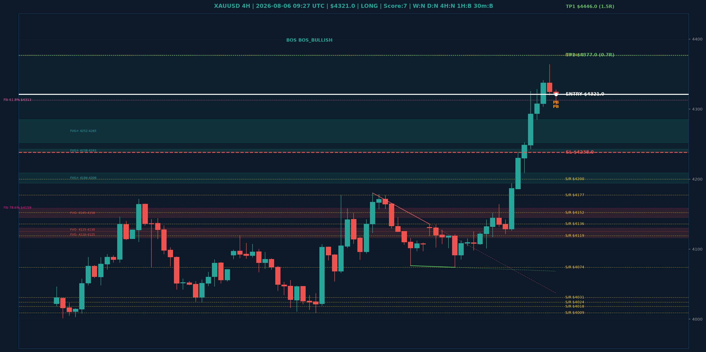

# XAUUSD Top-Down Analyse - 2026-08-06 09:27 UTC

> Prijs: $4321.0 | Beslissing: LONG | Score: 7

---

## Grafiek

---

## Top-Down Trend

| TF | Trend |
|---|---|
| Weekly | NEUTRAAL |
| Daily | NEUTRAAL |
| 4H | NEUTRAAL |
| 1H | BULLISH |
| 30min | BULLISH |
| 5min | NEUTRAAL |

## Fibonacci (swing $3962.0 - $4880.0)

| Level | Prijs |
|---|---|
| 23.6% | $4663.0 |
| 38.2% | $4529.0 |
| 50.0% | $4421.0 |
| 61.8% | $4313.0 |
| 78.6% | $4159.0 |

## Structuur

- **BOS 4H:** BOS_BULLISH
- **BOS 1H:** BOS_BULLISH
- **Pin bar 1H:** HAMMER@$4312.0, HAMMER@$4306.0
- **Pin bar 30min:** HAMMER@$4308.0, HAMMER@$4319.0

## Economic Calendar (USD vandaag)

- 🟡 **18:30 CEST** — Unemployment Claims (prev: 197K, fore: 203K)

## FVGs

Bullish 4H: [{'low': 4194.0, 'high': 4209.0}, {'low': 4238.0, 'high': 4243.0}, {'low': 4252.0, 'high': 4285.0}]
Bearish 4H: [{'low': 4145.0, 'high': 4158.0}, {'low': 4125.0, 'high': 4130.0}, {'low': 4116.0, 'high': 4125.0}]

## S/R

Daily: [3962.0, 4018.0, 4031.0, 4152.0, 4200.0, 4377.0, 4592.0]
4H: [4009.0, 4024.0, 4074.0, 4119.0, 4136.0, 4177.0]
1H: [4098.0, 4122.0, 4164.0, 4209.0, 4238.0, 4328.0, 4364.0]

## Trade Setup

| | |
|---|---|
| Entry | $4321.0 |
| Stop Loss | $4238.0 |
| TP1 | $4446.0 (1.5R) |
| TP2 | $4377.0 (0.7R) |

*MVR Trading Agent | 2026-08-06 09:27 UTC*
