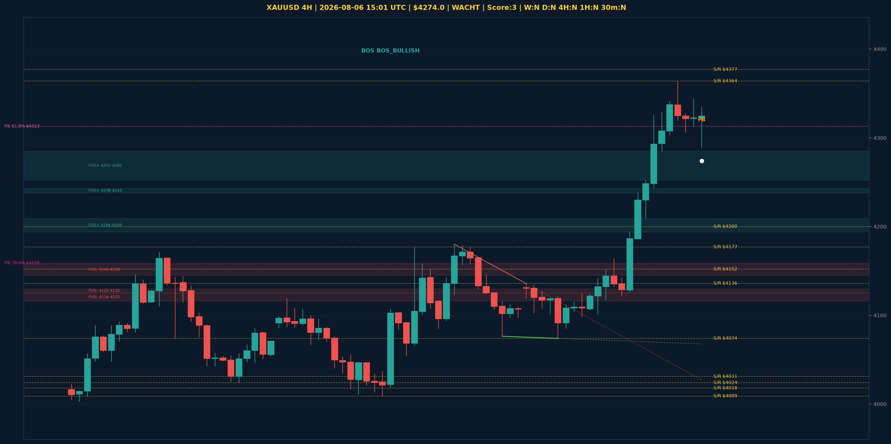

# XAUUSD Top-Down Analyse - 2026-08-06 15:01 UTC

> Prijs: $4274.0 | Beslissing: WACHT | Score: 3

---

## Grafiek

---

## Top-Down Trend

| TF | Trend |
|---|---|
| Weekly | NEUTRAAL |
| Daily | NEUTRAAL |
| 4H | NEUTRAAL |
| 1H | NEUTRAAL |
| 30min | NEUTRAAL |
| 5min | BULLISH |

## Fibonacci (swing $3962.0 - $4880.0)

| Level | Prijs |
|---|---|
| 23.6% | $4663.0 |
| 38.2% | $4529.0 |
| 50.0% | $4421.0 |
| 61.8% | $4313.0 |
| 78.6% | $4159.0 |

## Structuur

- **BOS 4H:** BOS_BULLISH
- **BOS 1H:** geen
- **Pin bar 1H:** HAMMER@$4323.0
- **Pin bar 30min:** HAMMER@$4288.0, SHOOTING_STAR@$4335.0

## Economic Calendar (USD vandaag)

- 🟡 **18:30 CEST** — Unemployment Claims (prev: 197K, fore: 203K)

## FVGs

Bullish 4H: [{'low': 4194.0, 'high': 4209.0}, {'low': 4238.0, 'high': 4243.0}, {'low': 4252.0, 'high': 4285.0}]
Bearish 4H: [{'low': 4145.0, 'high': 4158.0}, {'low': 4125.0, 'high': 4130.0}, {'low': 4116.0, 'high': 4125.0}]

## S/R

Daily: [3962.0, 4018.0, 4031.0, 4152.0, 4200.0, 4377.0, 4592.0]
4H: [4009.0, 4024.0, 4074.0, 4136.0, 4177.0, 4364.0]
1H: [4101.0, 4122.0, 4209.0, 4238.0, 4306.0, 4328.0, 4344.0, 4364.0]

*MVR Trading Agent | 2026-08-06 15:01 UTC*
