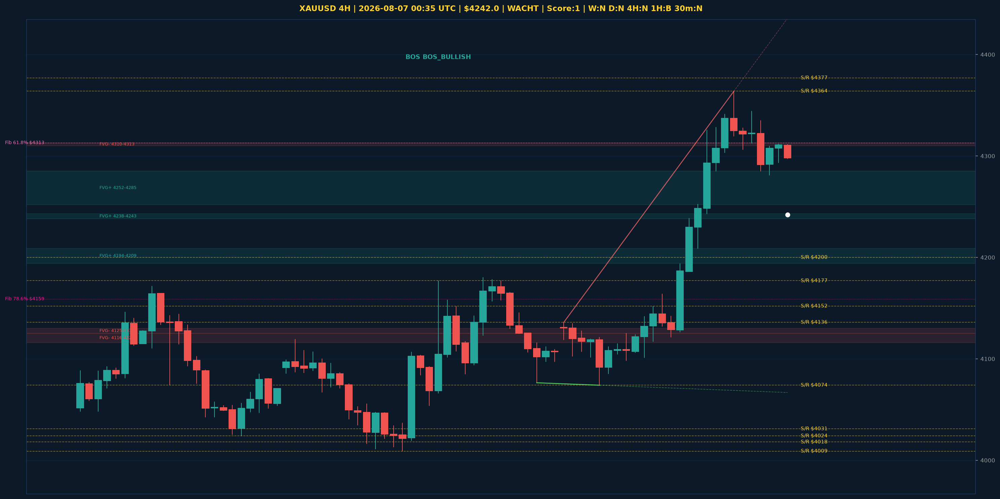

# XAUUSD Top-Down Analyse - 2026-08-07 00:35 UTC

> Prijs: $4242.0 | Beslissing: WACHT | Score: 1

---

## Grafiek

---

## Top-Down Trend

| TF | Trend |
|---|---|
| Weekly | NEUTRAAL |
| Daily | NEUTRAAL |
| 4H | NEUTRAAL |
| 1H | BEARISH |
| 30min | NEUTRAAL |
| 5min | BULLISH |

## Fibonacci (swing $3962.0 - $4880.0)

| Level | Prijs |
|---|---|
| 23.6% | $4663.0 |
| 38.2% | $4529.0 |
| 50.0% | $4421.0 |
| 61.8% | $4313.0 |
| 78.6% | $4159.0 |

## Structuur

- **BOS 4H:** BOS_BULLISH
- **BOS 1H:** BOS_BEARISH
- **Pin bar 1H:** geen
- **Pin bar 30min:** geen

## Economic Calendar (USD vandaag)

- 🔴 **18:30 CEST** — Average Hourly Earnings m/m (prev: 0.3%, fore: 0.3%)
- 🔴 **18:30 CEST** — Non-Farm Employment Change (prev: 57K, fore: 85K)
- 🔴 **18:30 CEST** — Unemployment Rate (prev: 4.2%, fore: 4.2%)

## FVGs

Bullish 4H: [{'low': 4194.0, 'high': 4209.0}, {'low': 4238.0, 'high': 4243.0}, {'low': 4252.0, 'high': 4285.0}]
Bearish 4H: [{'low': 4125.0, 'high': 4130.0}, {'low': 4116.0, 'high': 4125.0}, {'low': 4310.0, 'high': 4313.0}]

## S/R

Daily: [3962.0, 4018.0, 4031.0, 4152.0, 4200.0, 4377.0, 4592.0]
4H: [4009.0, 4024.0, 4074.0, 4136.0, 4177.0, 4364.0]
1H: [4122.0, 4209.0, 4281.0, 4306.0, 4328.0, 4344.0, 4364.0]

*MVR Trading Agent | 2026-08-07 00:35 UTC*
