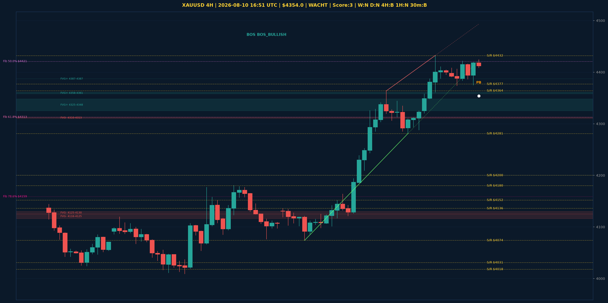

# XAUUSD Top-Down Analyse - 2026-08-10 16:51 UTC

> Prijs: $4354.0 | Beslissing: WACHT | Score: 3

---

## Grafiek

---

## Top-Down Trend

| TF | Trend |
|---|---|
| Weekly | NEUTRAAL |
| Daily | NEUTRAAL |
| 4H | BULLISH |
| 1H | NEUTRAAL |
| 30min | BULLISH |
| 5min | BULLISH |

## Fibonacci (swing $3962.0 - $4880.0)

| Level | Prijs |
|---|---|
| 23.6% | $4663.0 |
| 38.2% | $4529.0 |
| 50.0% | $4421.0 |
| 61.8% | $4313.0 |
| 78.6% | $4159.0 |

## Structuur

- **BOS 4H:** BOS_BULLISH
- **BOS 1H:** geen
- **Pin bar 1H:** HAMMER@$4383.0
- **Pin bar 30min:** SHOOTING_STAR@$4411.0

## FVGs

Bullish 4H: [{'low': 4325.0, 'high': 4348.0}, {'low': 4358.0, 'high': 4361.0}, {'low': 4387.0, 'high': 4387.0}]
Bearish 4H: [{'low': 4125.0, 'high': 4130.0}, {'low': 4116.0, 'high': 4125.0}, {'low': 4310.0, 'high': 4313.0}]

## S/R

Daily: [3962.0, 4018.0, 4031.0, 4152.0, 4200.0, 4377.0, 4592.0]
4H: [4074.0, 4136.0, 4180.0, 4281.0, 4364.0, 4432.0]
1H: [4288.0, 4335.0, 4361.0, 4375.0, 4411.0, 4432.0]

*MVR Trading Agent | 2026-08-10 16:51 UTC*
