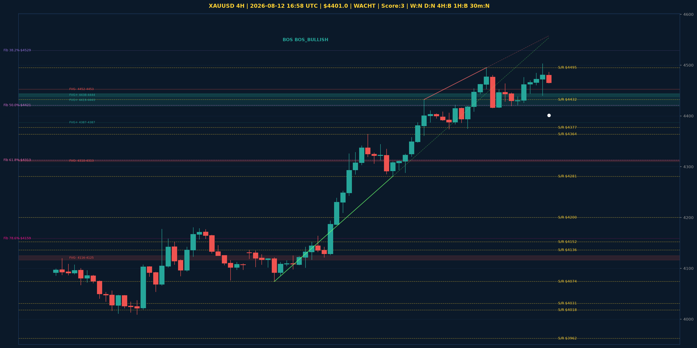

# XAUUSD Top-Down Analyse - 2026-08-12 16:58 UTC

> Prijs: $4401.0 | Beslissing: WACHT | Score: 3

---

## Grafiek

---

## Top-Down Trend

| TF | Trend |
|---|---|
| Weekly | NEUTRAAL |
| Daily | NEUTRAAL |
| 4H | BULLISH |
| 1H | BULLISH |
| 30min | NEUTRAAL |
| 5min | BEARISH |

## Fibonacci (swing $3962.0 - $4880.0)

| Level | Prijs |
|---|---|
| 23.6% | $4663.0 |
| 38.2% | $4529.0 |
| 50.0% | $4421.0 |
| 61.8% | $4313.0 |
| 78.6% | $4159.0 |

## Structuur

- **BOS 4H:** BOS_BULLISH
- **BOS 1H:** BOS_BULLISH
- **Pin bar 1H:** geen
- **Pin bar 30min:** HAMMER@$4470.0

## Economic Calendar (USD vandaag)

- 🔴 **18:30 CEST** — Core CPI m/m (prev: 0.0%, fore: 0.2%)
- 🔴 **18:30 CEST** — Core CPI y/y (prev: 2.6%, fore: 2.5%)
- 🔴 **18:30 CEST** — CPI m/m (prev: -0.4%, fore: 0.1%)
- 🔴 **18:30 CEST** — CPI y/y (prev: 3.5%, fore: 3.4%)

> ⚠️ HIGH IMPACT 28 min geleden: Core CPI m/m

## FVGs

Bullish 4H: [{'low': 4387.0, 'high': 4387.0}, {'low': 4419.0, 'high': 4443.0}, {'low': 4438.0, 'high': 4444.0}]
Bearish 4H: [{'low': 4116.0, 'high': 4125.0}, {'low': 4310.0, 'high': 4313.0}, {'low': 4452.0, 'high': 4453.0}]

## S/R

Daily: [3962.0, 4018.0, 4031.0, 4152.0, 4200.0, 4377.0, 4592.0]
4H: [4074.0, 4136.0, 4281.0, 4364.0, 4432.0, 4495.0]
1H: [4416.0, 4440.0, 4463.0, 4495.0]

*MVR Trading Agent | 2026-08-12 16:58 UTC*
