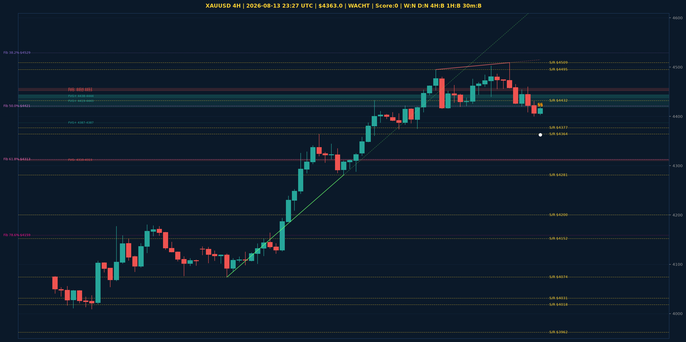

# XAUUSD Liquidity Sweep Analyse - 2026-08-13 23:27 UTC

> Prijs: $4363.0 | Beslissing: WACHT | Score: 0

---

## Liquidity Sweep

- **Manipulatie:** geen sweep gedetecteerd
- **5m reversal (BOS/iFVG):** niet bevestigd (iFVG: geen)
- **1m entry trigger:** niet bevestigd
- **DXY 5m trend:** BEARISH | **Correlatie:** niet aligned
- **Draws on liquidity (highs):** [4459.0, 4460.0, 4465.0, 4509.0]
- **Draws on liquidity (lows):** [4400.0, 4420.0, 4426.0]

---

## Grafiek

---

## Top-Down Trend

| TF | Trend |
|---|---|
| Weekly | NEUTRAAL |
| Daily | NEUTRAAL |
| 4H | BULLISH |
| 1H | BEARISH |
| 30min | BEARISH |
| 5min | BULLISH |

## Fibonacci (swing $3962.0 - $4880.0)

| Level | Prijs |
|---|---|
| 23.6% | $4663.0 |
| 38.2% | $4529.0 |
| 50.0% | $4421.0 |
| 61.8% | $4313.0 |
| 78.6% | $4159.0 |

## Structuur

- **BOS 4H:** geen
- **BOS 1H:** BOS_BEARISH
- **Pin bar 1H:** SHOOTING_STAR@$4420.0, SHOOTING_STAR@$4418.0
- **Pin bar 30min:** HAMMER@$4404.0, SHOOTING_STAR@$4418.0

## Economic Calendar (USD vandaag)

- 🔴 **18:30 CEST** — Core PPI m/m (prev: 0.2%, fore: 0.3%)
- 🔴 **18:30 CEST** — PPI m/m (prev: -0.3%, fore: 0.2%)
- 🟡 **18:30 CEST** — Unemployment Claims (prev: 199K, fore: 202K)

## FVGs

Bullish 4H: [{'low': 4387.0, 'high': 4387.0}, {'low': 4419.0, 'high': 4443.0}, {'low': 4438.0, 'high': 4444.0}]
Bearish 4H: [{'low': 4310.0, 'high': 4313.0}, {'low': 4452.0, 'high': 4453.0}, {'low': 4454.0, 'high': 4457.0}]

## S/R

Daily: [3962.0, 4018.0, 4031.0, 4152.0, 4200.0, 4377.0, 4592.0]
4H: [4074.0, 4281.0, 4364.0, 4432.0, 4495.0, 4509.0]
1H: [4400.0, 4420.0, 4440.0, 4456.0, 4476.0, 4503.0]

*MVR Trading Agent | 2026-08-13 23:27 UTC*
