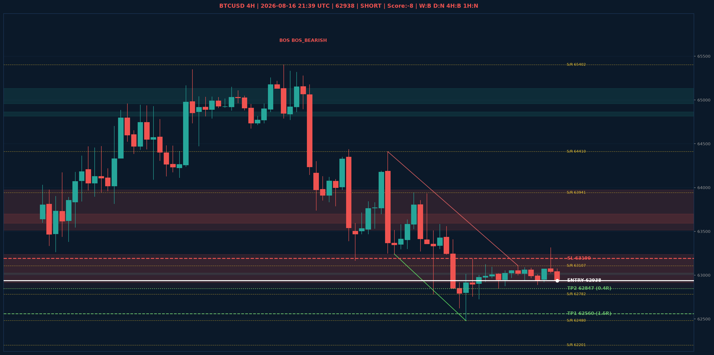

# BTCUSD Liquidity Sweep Analyse - 2026-08-16 21:39 UTC

> Prijs: 62938 | Beslissing: SHORT | Score: -8

---

## Liquidity Sweep

- **Manipulatie:** BEARISH @ 63009
- **5m reversal (BOS/iFVG):** bevestigd (iFVG: BEARISH)
- **1m entry trigger:** bevestigd
- **XRP 5m trend:** BEARISH | **Correlatie:** OK
- **Draws on liquidity (highs):** [63009.0, 63087.0, 63313.0]
- **Draws on liquidity (lows):** [62847.0, 62891.0, 62939.0, 62947.0]

---

## Grafiek

---

## Top-Down Trend

| TF | Trend |
|---|---|
| Weekly | BEARISH |
| Daily | NEUTRAAL |
| 4H | BEARISH |
| 1H | NEUTRAAL |
| 30min | NEUTRAAL |
| 5min | NEUTRAAL |

## Fibonacci (swing 57748 - 78101)

| Level | Prijs |
|---|---|
| 23.6% | 73297 |
| 38.2% | 70326 |
| 50.0% | 67924 |
| 61.8% | 65523 |
| 78.6% | 62103 |

## S/R

Daily: [57748.0, 58076.0, 62201.0, 65402.0, 66910.0]
4H: [62480.0, 62782.0, 63107.0, 63941.0, 64410.0]
1H: [62727.0, 62939.0, 63313.0]

## Trade Setup

| | |
|---|---|
| Entry | 62938 |
| Stop Loss | 63190 |
| TP1 | 62560 (1.5R) |
| TP2 | 62847 (0.4R) |

*MVR Trading Agent | 2026-08-16 21:39 UTC*
