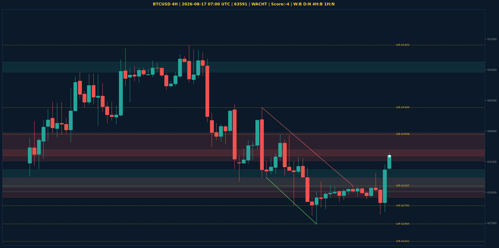

# BTCUSD Liquidity Sweep Analyse - 2026-08-17 07:00 UTC

> Prijs: 63591 | Beslissing: WACHT | Score: -4

---

## Liquidity Sweep

- **Manipulatie:** BEARISH @ 63653
- **5m reversal (BOS/iFVG):** niet bevestigd (iFVG: BULLISH)
- **1m entry trigger:** niet bevestigd
- **XRP 5m trend:** BEARISH | **Correlatie:** OK
- **Draws on liquidity (highs):** [63653.0]
- **Draws on liquidity (lows):** [62641.0, 62681.0]

---

## Grafiek

---

## Top-Down Trend

| TF | Trend |
|---|---|
| Weekly | BEARISH |
| Daily | NEUTRAAL |
| 4H | BEARISH |
| 1H | NEUTRAAL |
| 30min | NEUTRAAL |
| 5min | BULLISH |

## Fibonacci (swing 57748 - 78101)

| Level | Prijs |
|---|---|
| 23.6% | 73297 |
| 38.2% | 70326 |
| 50.0% | 67924 |
| 61.8% | 65523 |
| 78.6% | 62103 |

## S/R

Daily: [57748.0, 58076.0, 62201.0, 65402.0, 66910.0]
4H: [62484.0, 62782.0, 63107.0, 63948.0, 64384.0]
1H: [62641.0, 62847.0, 63055.0, 63313.0]

*MVR Trading Agent | 2026-08-17 07:00 UTC*
