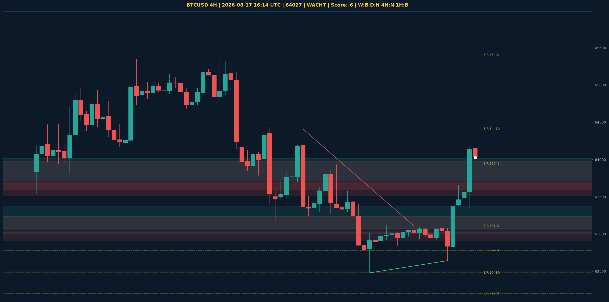

# BTCUSD Liquidity Sweep Analyse - 2026-08-17 16:14 UTC

> Prijs: 64027 | Beslissing: WACHT | Score: -6

---

## Liquidity Sweep

- **Manipulatie:** BEARISH @ 64174
- **5m reversal (BOS/iFVG):** bevestigd (iFVG: BEARISH)
- **1m entry trigger:** bevestigd
- **XRP 5m trend:** NEUTRAAL | **Correlatie:** niet aligned
- **Draws on liquidity (highs):** [63653.0, 63716.0, 64174.0]
- **Draws on liquidity (lows):** [62643.0, 62681.0, 63218.0, 63357.0]

---

## Grafiek

---

## Top-Down Trend

| TF | Trend |
|---|---|
| Weekly | BEARISH |
| Daily | NEUTRAAL |
| 4H | NEUTRAAL |
| 1H | BULLISH |
| 30min | BULLISH |
| 5min | NEUTRAAL |

## Fibonacci (swing 57748 - 78101)

| Level | Prijs |
|---|---|
| 23.6% | 73297 |
| 38.2% | 70326 |
| 50.0% | 67924 |
| 61.8% | 65523 |
| 78.6% | 62103 |

## S/R

Daily: [57748.0, 58076.0, 62201.0, 65402.0, 66910.0]
4H: [62480.0, 62782.0, 63107.0, 63941.0, 64410.0]
1H: [62643.0, 62891.0, 63087.0, 63313.0, 63653.0]

*MVR Trading Agent | 2026-08-17 16:14 UTC*
