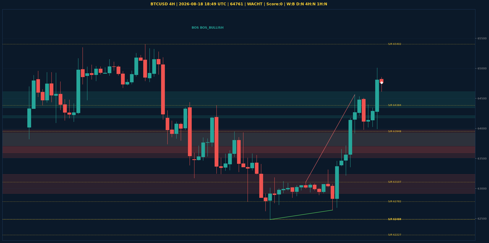

# BTCUSD Liquidity Sweep Analyse - 2026-08-18 18:49 UTC

> Prijs: 64761 | Beslissing: WACHT | Score: 0

---

## Liquidity Sweep

- **Manipulatie:** geen sweep gedetecteerd
- **5m reversal (BOS/iFVG):** niet bevestigd (iFVG: geen)
- **1m entry trigger:** niet bevestigd
- **XRP 5m trend:** NEUTRAAL | **Correlatie:** niet aligned
- **Draws on liquidity (highs):** [64342.0, 64507.0, 65007.0]
- **Draws on liquidity (lows):** [62641.0, 63979.0, 63991.0, 64027.0]

---

## Grafiek

---

## Top-Down Trend

| TF | Trend |
|---|---|
| Weekly | BEARISH |
| Daily | NEUTRAAL |
| 4H | NEUTRAAL |
| 1H | NEUTRAAL |
| 30min | NEUTRAAL |
| 5min | BEARISH |

## Fibonacci (swing 57748 - 78101)

| Level | Prijs |
|---|---|
| 23.6% | 73297 |
| 38.2% | 70326 |
| 50.0% | 67924 |
| 61.8% | 65523 |
| 78.6% | 62103 |

## S/R

Daily: [57748.0, 58076.0, 62227.0, 62488.0, 65402.0, 66910.0]
4H: [62484.0, 62782.0, 63107.0, 63948.0, 64384.0]
1H: [63218.0, 63979.0, 64397.0, 65007.0]

*MVR Trading Agent | 2026-08-18 18:49 UTC*
