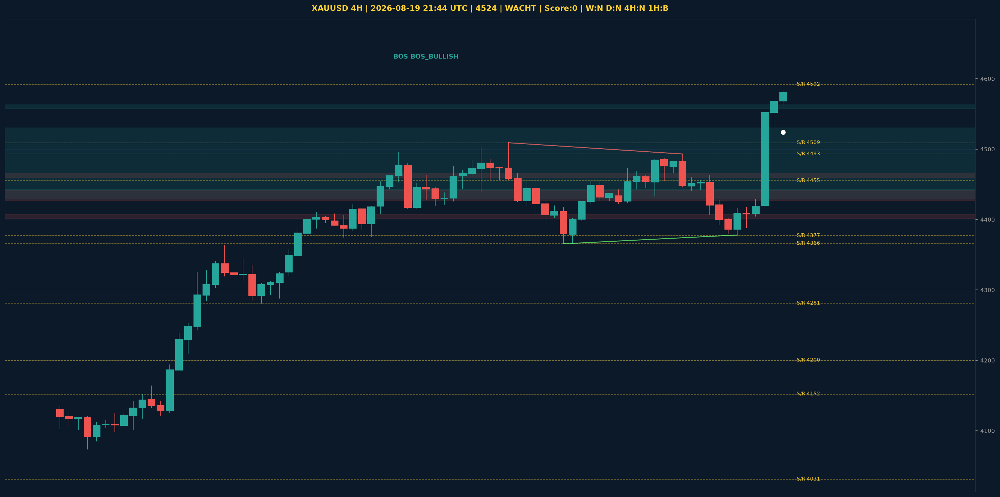

# XAUUSD Liquidity Sweep Analyse - 2026-08-19 21:44 UTC

> Prijs: 4524 | Beslissing: WACHT | Score: 0

---

## Liquidity Sweep

- **Manipulatie:** geen sweep gedetecteerd
- **5m reversal (BOS/iFVG):** niet bevestigd (iFVG: geen)
- **1m entry trigger:** niet bevestigd
- **DXY 5m trend:** BEARISH | **Correlatie:** niet aligned
- **Draws on liquidity (highs):** [4417.0, 4500.0, 4583.0]
- **Draws on liquidity (lows):** [4378.0, 4388.0, 4405.0, 4481.0]

---

## Grafiek

---

## Top-Down Trend

| TF | Trend |
|---|---|
| Weekly | NEUTRAAL |
| Daily | NEUTRAAL |
| 4H | NEUTRAAL |
| 1H | BEARISH |
| 30min | BULLISH |
| 5min | NEUTRAAL |

## Fibonacci (swing 3962 - 4880)

| Level | Prijs |
|---|---|
| 23.6% | 4663 |
| 38.2% | 4529 |
| 50.0% | 4421 |
| 61.8% | 4313 |
| 78.6% | 4159 |

## S/R

Daily: [3962.0, 4018.0, 4031.0, 4152.0, 4200.0, 4377.0, 4592.0]
4H: [4281.0, 4366.0, 4455.0, 4493.0, 4509.0]
1H: [4378.0, 4407.0, 4441.0, 4460.0, 4558.0]

*MVR Trading Agent | 2026-08-19 21:44 UTC*
