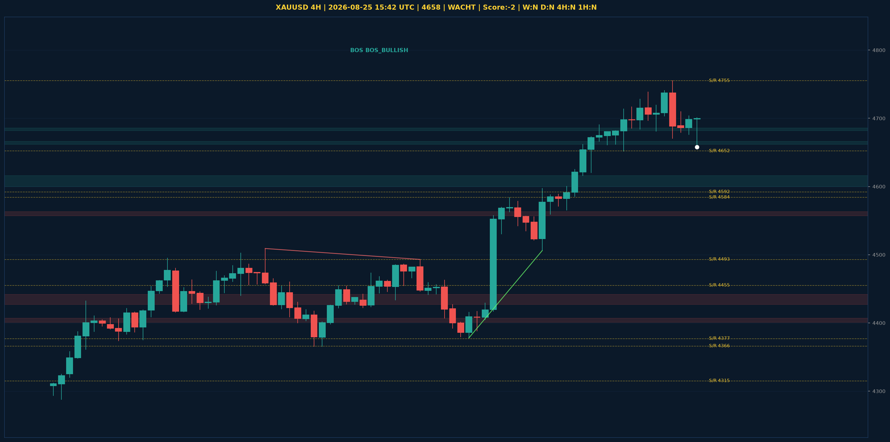

# XAUUSD Liquidity Sweep Analyse - 2026-08-25 15:42 UTC

> Prijs: 4658 | Beslissing: WACHT | Score: -2

---

## Liquidity Sweep

- **Manipulatie:** BEARISH @ 4704
- **5m reversal (BOS/iFVG):** niet bevestigd (iFVG: BULLISH)
- **1m entry trigger:** niet bevestigd
- **DXY 5m trend:** NEUTRAAL | **Correlatie:** niet aligned
- **Draws on liquidity (highs):** [4704.0, 4708.0, 4710.0, 4755.0]
- **Draws on liquidity (lows):** [4652.0, 4660.0, 4676.0, 4679.0]

---

## Grafiek

---

## Top-Down Trend

| TF | Trend |
|---|---|
| Weekly | NEUTRAAL |
| Daily | NEUTRAAL |
| 4H | NEUTRAAL |
| 1H | NEUTRAAL |
| 30min | NEUTRAAL |
| 5min | NEUTRAAL |

## Fibonacci (swing 3962 - 4880)

| Level | Prijs |
|---|---|
| 23.6% | 4663 |
| 38.2% | 4529 |
| 50.0% | 4421 |
| 61.8% | 4313 |
| 78.6% | 4159 |

## S/R

Daily: [3962.0, 4018.0, 4152.0, 4200.0, 4315.0, 4377.0, 4592.0]
4H: [4366.0, 4455.0, 4493.0, 4584.0, 4652.0, 4755.0]
1H: [4670.0, 4704.0, 4738.0, 4755.0]

*MVR Trading Agent | 2026-08-25 15:42 UTC*
