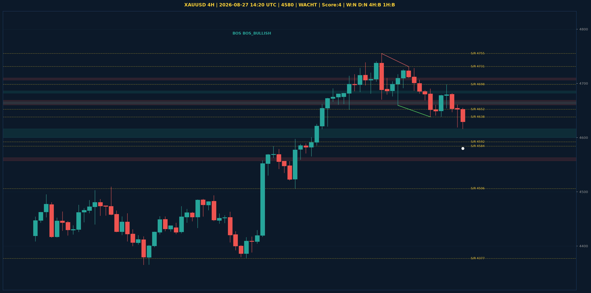

# XAUUSD Liquidity Sweep Analyse - 2026-08-27 14:20 UTC

> Prijs: 4580 | Beslissing: WACHT | Score: 4

---

## Liquidity Sweep

- **Manipulatie:** BULLISH @ 4619
- **5m reversal (BOS/iFVG):** niet bevestigd (iFVG: BEARISH)
- **1m entry trigger:** niet bevestigd
- **DXY 5m trend:** BEARISH | **Correlatie:** OK
- **Draws on liquidity (highs):** [4646.0, 4660.0, 4682.0, 4698.0, 4731.0]
- **Draws on liquidity (lows):** [4616.0, 4619.0, 4647.0]

---

## Grafiek

---

## Top-Down Trend

| TF | Trend |
|---|---|
| Weekly | NEUTRAAL |
| Daily | NEUTRAAL |
| 4H | BULLISH |
| 1H | BEARISH |
| 30min | NEUTRAAL |
| 5min | BEARISH |

## Fibonacci (swing 3962 - 4765)

| Level | Prijs |
|---|---|
| 23.6% | 4576 |
| 38.2% | 4459 |
| 50.0% | 4364 |
| 61.8% | 4269 |
| 78.6% | 4134 |

## S/R

Daily: [3962.0, 4018.0, 4152.0, 4200.0, 4315.0, 4377.0, 4592.0]
4H: [4506.0, 4584.0, 4638.0, 4652.0, 4698.0, 4731.0, 4755.0]
1H: [4638.0, 4660.0, 4686.0, 4716.0, 4731.0]

*MVR Trading Agent | 2026-08-27 14:20 UTC*
