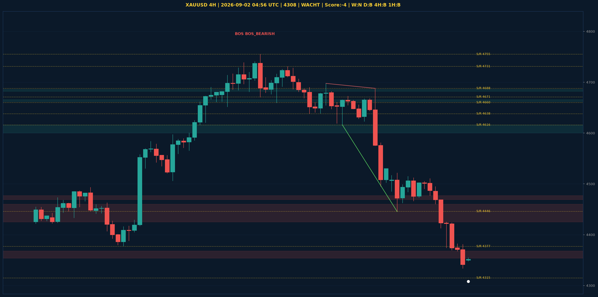

# XAUUSD Liquidity Sweep Analyse - 2026-09-02 04:56 UTC

> Prijs: 4308 | Beslissing: WACHT | Score: -4

---

## Liquidity Sweep

- **Manipulatie:** BEARISH @ 4354
- **5m reversal (BOS/iFVG):** niet bevestigd (iFVG: geen)
- **1m entry trigger:** niet bevestigd
- **DXY 5m trend:** BULLISH | **Correlatie:** OK
- **Draws on liquidity (highs):** [4354.0, 4495.0, 4515.0]
- **Draws on liquidity (lows):** [4334.0, 4348.0]

---

## Grafiek

---

## Top-Down Trend

| TF | Trend |
|---|---|
| Weekly | NEUTRAAL |
| Daily | BULLISH |
| 4H | BEARISH |
| 1H | BEARISH |
| 30min | BEARISH |
| 5min | NEUTRAAL |

## Fibonacci (swing 3962 - 4765)

| Level | Prijs |
|---|---|
| 23.6% | 4576 |
| 38.2% | 4459 |
| 50.0% | 4364 |
| 61.8% | 4269 |
| 78.6% | 4134 |

## S/R

Daily: [3962.0, 4018.0, 4152.0, 4200.0, 4315.0, 4377.0, 4671.0]
4H: [4446.0, 4616.0, 4638.0, 4660.0, 4688.0, 4731.0, 4755.0]
1H: [4334.0, 4374.0, 4446.0, 4466.0, 4510.0, 4668.0, 4688.0]

*MVR Trading Agent | 2026-09-02 04:56 UTC*
