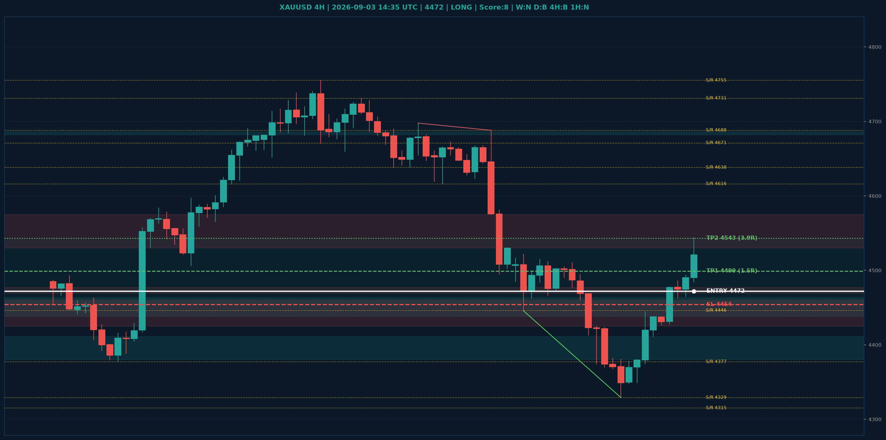

# XAUUSD Liquidity Sweep Analyse - 2026-09-03 14:35 UTC

> Prijs: 4472 | Beslissing: LONG | Score: 8

---

## Liquidity Sweep

- **Manipulatie:** BULLISH @ 4503
- **5m reversal (BOS/iFVG):** bevestigd (iFVG: BEARISH)
- **1m entry trigger:** bevestigd
- **DXY 5m trend:** BEARISH | **Correlatie:** OK
- **Draws on liquidity (highs):** [4486.0, 4543.0, 4544.0]
- **Draws on liquidity (lows):** [4329.0, 4411.0, 4463.0, 4465.0, 4503.0]

---

## Grafiek

---

## Top-Down Trend

| TF | Trend |
|---|---|
| Weekly | NEUTRAAL |
| Daily | BULLISH |
| 4H | BEARISH |
| 1H | NEUTRAAL |
| 30min | BULLISH |
| 5min | BULLISH |

## Fibonacci (swing 3962 - 4765)

| Level | Prijs |
|---|---|
| 23.6% | 4576 |
| 38.2% | 4459 |
| 50.0% | 4364 |
| 61.8% | 4269 |
| 78.6% | 4134 |

## S/R

Daily: [3962.0, 4018.0, 4152.0, 4200.0, 4315.0, 4377.0, 4671.0]
4H: [4329.0, 4446.0, 4616.0, 4638.0, 4688.0, 4731.0, 4755.0]
1H: [4329.0, 4349.0, 4374.0, 4444.0, 4463.0, 4510.0, 4688.0]

## Trade Setup

| | |
|---|---|
| Entry | 4472 |
| Stop Loss | 4454 |
| TP1 | 4499 (1.5R) |
| TP2 | 4543 (3.9R) |

*MVR Trading Agent | 2026-09-03 14:35 UTC*
