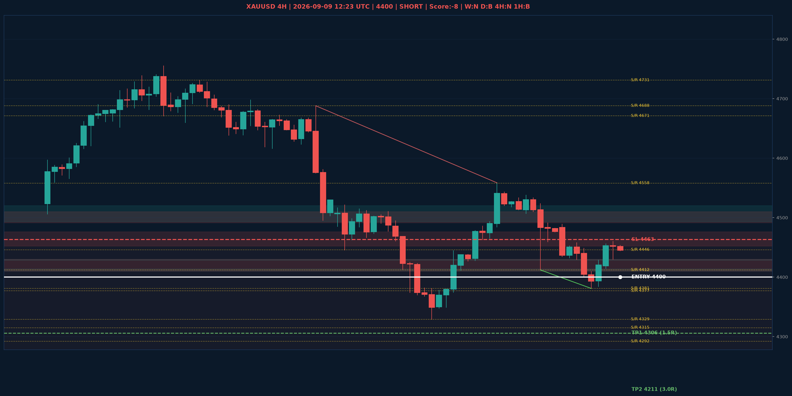

# XAUUSD Liquidity Sweep Analyse - 2026-09-09 12:23 UTC

> Prijs: 4400 | Beslissing: SHORT | Score: -8

---

## Liquidity Sweep

- **Manipulatie:** BEARISH @ 4456
- **5m reversal (BOS/iFVG):** bevestigd (iFVG: BEARISH)
- **1m entry trigger:** bevestigd
- **DXY 5m trend:** BULLISH | **Correlatie:** OK
- **Draws on liquidity (highs):** [4456.0, 4460.0, 4524.0]
- **Draws on liquidity (lows):** [4381.0, 4414.0, 4430.0]

---

## Grafiek

---

## Top-Down Trend

| TF | Trend |
|---|---|
| Weekly | NEUTRAAL |
| Daily | BULLISH |
| 4H | NEUTRAAL |
| 1H | BEARISH |
| 30min | BEARISH |
| 5min | NEUTRAAL |

## Fibonacci (swing 3962 - 4765)

| Level | Prijs |
|---|---|
| 23.6% | 4576 |
| 38.2% | 4459 |
| 50.0% | 4364 |
| 61.8% | 4269 |
| 78.6% | 4134 |

## S/R

Daily: [3964.0, 4018.0, 4152.0, 4200.0, 4292.0, 4315.0, 4377.0, 4671.0]
4H: [4329.0, 4381.0, 4412.0, 4446.0, 4558.0, 4688.0, 4731.0]
1H: [4381.0, 4430.0, 4456.0, 4489.0, 4538.0]

## Trade Setup

| | |
|---|---|
| Entry | 4400 |
| Stop Loss | 4463 |
| TP1 | 4306 (1.5R) |
| TP2 | 4211 (3.0R) |

*MVR Trading Agent | 2026-09-09 12:23 UTC*
