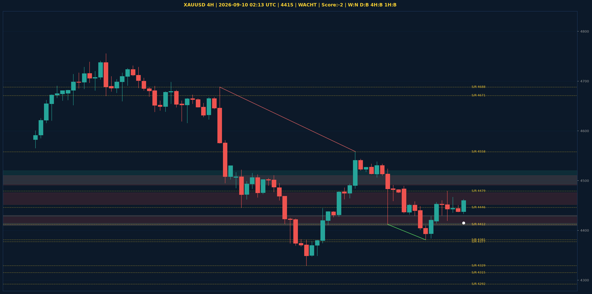

# XAUUSD Liquidity Sweep Analyse - 2026-09-10 02:13 UTC

> Prijs: 4415 | Beslissing: WACHT | Score: -2

---

## Liquidity Sweep

- **Manipulatie:** BEARISH @ 4462
- **5m reversal (BOS/iFVG):** niet bevestigd (iFVG: BULLISH)
- **1m entry trigger:** niet bevestigd
- **DXY 5m trend:** BEARISH | **Correlatie:** niet aligned
- **Draws on liquidity (highs):** [4462.0, 4479.0, 4489.0]
- **Draws on liquidity (lows):** [4381.0, 4411.0, 4433.0]

---

## Grafiek

---

## Top-Down Trend

| TF | Trend |
|---|---|
| Weekly | NEUTRAAL |
| Daily | BULLISH |
| 4H | BEARISH |
| 1H | BULLISH |
| 30min | BEARISH |
| 5min | BULLISH |

## Fibonacci (swing 3962 - 4765)

| Level | Prijs |
|---|---|
| 23.6% | 4576 |
| 38.2% | 4459 |
| 50.0% | 4364 |
| 61.8% | 4269 |
| 78.6% | 4134 |

## S/R

Daily: [3964.0, 4018.0, 4152.0, 4200.0, 4292.0, 4315.0, 4377.0, 4671.0]
4H: [4329.0, 4381.0, 4412.0, 4446.0, 4479.0, 4558.0, 4688.0]
1H: [4381.0, 4419.0, 4456.0, 4479.0]

*MVR Trading Agent | 2026-09-10 02:13 UTC*
