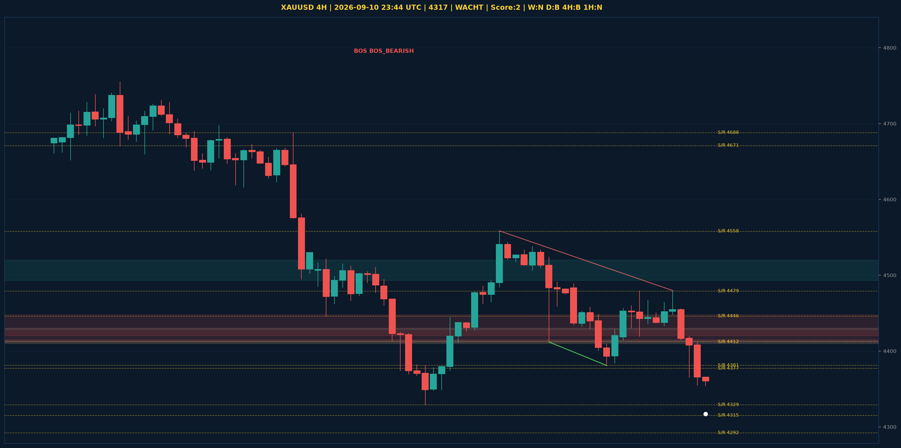

# XAUUSD Liquidity Sweep Analyse - 2026-09-10 23:44 UTC

> Prijs: 4317 | Beslissing: WACHT | Score: 2

---

## Liquidity Sweep

- **Manipulatie:** BULLISH @ 4355
- **5m reversal (BOS/iFVG):** niet bevestigd (iFVG: BEARISH)
- **1m entry trigger:** niet bevestigd
- **DXY 5m trend:** BULLISH | **Correlatie:** niet aligned
- **Draws on liquidity (highs):** [4419.0, 4456.0, 4480.0]
- **Draws on liquidity (lows):** [4354.0, 4355.0, 4365.0, 4448.0]

---

## Grafiek

---

## Top-Down Trend

| TF | Trend |
|---|---|
| Weekly | NEUTRAAL |
| Daily | BULLISH |
| 4H | BEARISH |
| 1H | NEUTRAAL |
| 30min | NEUTRAAL |
| 5min | BEARISH |

## Fibonacci (swing 3962 - 4765)

| Level | Prijs |
|---|---|
| 23.6% | 4576 |
| 38.2% | 4459 |
| 50.0% | 4364 |
| 61.8% | 4269 |
| 78.6% | 4134 |

## S/R

Daily: [3964.0, 4018.0, 4152.0, 4200.0, 4292.0, 4315.0, 4377.0, 4671.0]
4H: [4329.0, 4381.0, 4412.0, 4446.0, 4479.0, 4558.0, 4688.0]
1H: [4365.0, 4419.0, 4433.0, 4456.0, 4479.0]

*MVR Trading Agent | 2026-09-10 23:44 UTC*
