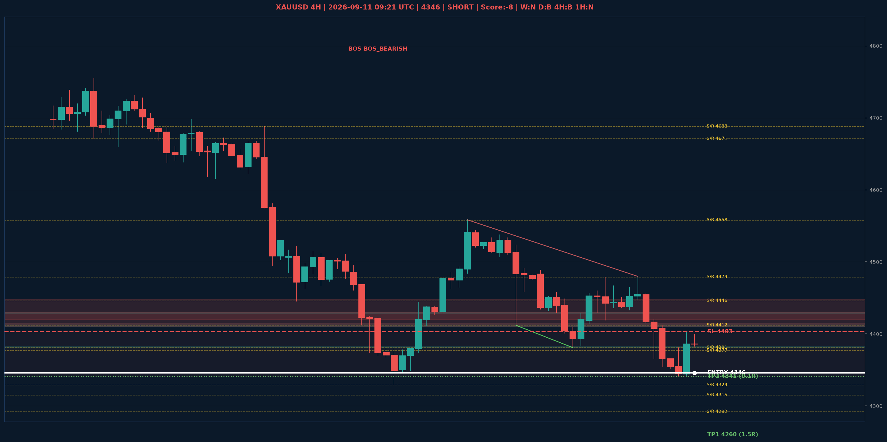

# XAUUSD Liquidity Sweep Analyse - 2026-09-11 09:21 UTC

> Prijs: 4346 | Beslissing: SHORT | Score: -8

---

## Liquidity Sweep

- **Manipulatie:** BEARISH @ 4399
- **5m reversal (BOS/iFVG):** bevestigd (iFVG: geen)
- **1m entry trigger:** bevestigd
- **DXY 5m trend:** BULLISH | **Correlatie:** OK
- **Draws on liquidity (highs):** [4399.0, 4402.0, 4443.0, 4480.0]
- **Draws on liquidity (lows):** [4341.0, 4342.0, 4383.0]

---

## Grafiek

---

## Top-Down Trend

| TF | Trend |
|---|---|
| Weekly | NEUTRAAL |
| Daily | BULLISH |
| 4H | BEARISH |
| 1H | NEUTRAAL |
| 30min | NEUTRAAL |
| 5min | NEUTRAAL |

## Fibonacci (swing 3962 - 4765)

| Level | Prijs |
|---|---|
| 23.6% | 4576 |
| 38.2% | 4459 |
| 50.0% | 4364 |
| 61.8% | 4269 |
| 78.6% | 4134 |

## S/R

Daily: [3964.0, 4018.0, 4152.0, 4200.0, 4292.0, 4315.0, 4377.0, 4671.0]
4H: [4329.0, 4381.0, 4412.0, 4446.0, 4479.0, 4558.0, 4688.0]
1H: [4341.0, 4365.0, 4381.0, 4402.0, 4433.0, 4479.0]

## Trade Setup

| | |
|---|---|
| Entry | 4346 |
| Stop Loss | 4403 |
| TP1 | 4260 (1.5R) |
| TP2 | 4341 (0.1R) |

*MVR Trading Agent | 2026-09-11 09:21 UTC*
