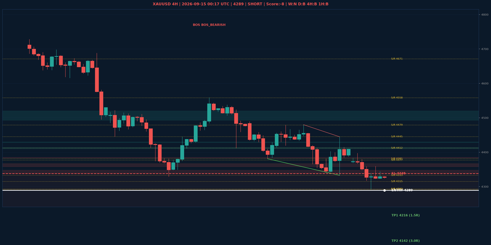

# XAUUSD Liquidity Sweep Analyse - 2026-09-15 00:17 UTC

> Prijs: 4289 | Beslissing: SHORT | Score: -8

---

## Liquidity Sweep

- **Manipulatie:** BEARISH @ 4330
- **5m reversal (BOS/iFVG):** bevestigd (iFVG: BEARISH)
- **1m entry trigger:** bevestigd
- **DXY 5m trend:** BULLISH | **Correlatie:** OK
- **Draws on liquidity (highs):** [4330.0, 4397.0, 4445.0]
- **Draws on liquidity (lows):** [4293.0, 4324.0]

---

## Grafiek

---

## Top-Down Trend

| TF | Trend |
|---|---|
| Weekly | NEUTRAAL |
| Daily | BULLISH |
| 4H | BEARISH |
| 1H | BEARISH |
| 30min | BULLISH |
| 5min | NEUTRAAL |

## Fibonacci (swing 3962 - 4765)

| Level | Prijs |
|---|---|
| 23.6% | 4576 |
| 38.2% | 4459 |
| 50.0% | 4364 |
| 61.8% | 4269 |
| 78.6% | 4134 |

## S/R

Daily: [3964.0, 4018.0, 4152.0, 4200.0, 4292.0, 4315.0, 4377.0, 4671.0]
4H: [4293.0, 4333.0, 4381.0, 4412.0, 4445.0, 4479.0, 4558.0]
1H: [4293.0, 4323.0, 4341.0, 4359.0, 4379.0, 4397.0, 4445.0]

## Trade Setup

| | |
|---|---|
| Entry | 4289 |
| Stop Loss | 4338 |
| TP1 | 4216 (1.5R) |
| TP2 | 4142 (3.0R) |

*MVR Trading Agent | 2026-09-15 00:17 UTC*
