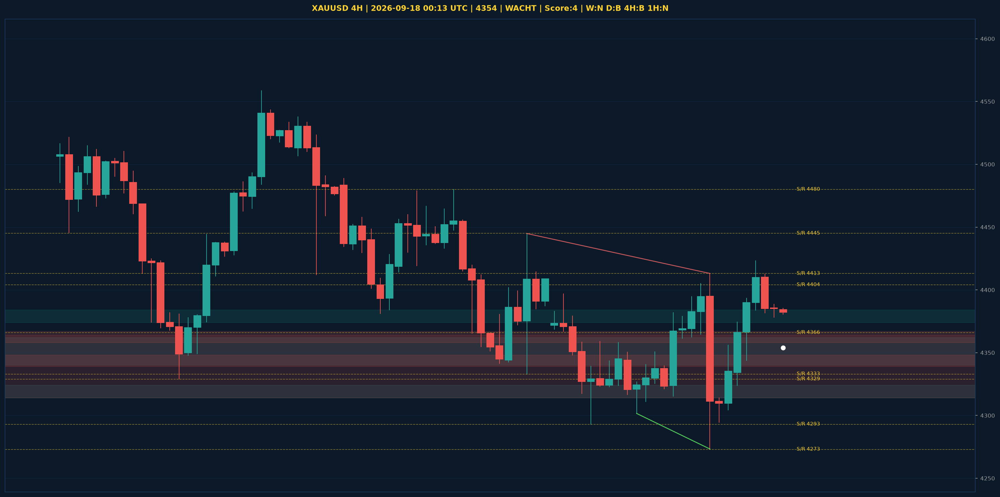

# XAUUSD Liquidity Sweep Analyse - 2026-09-18 00:13 UTC

> Prijs: 4354 | Beslissing: WACHT | Score: 4

---

## Liquidity Sweep

- **Manipulatie:** BULLISH @ 4381
- **5m reversal (BOS/iFVG):** niet bevestigd (iFVG: BEARISH)
- **1m entry trigger:** niet bevestigd
- **DXY 5m trend:** BEARISH | **Correlatie:** OK
- **Draws on liquidity (highs):** [4385.0, 4423.0]
- **Draws on liquidity (lows):** [4273.0, 4304.0, 4381.0]

---

## Grafiek

---

## Top-Down Trend

| TF | Trend |
|---|---|
| Weekly | NEUTRAAL |
| Daily | BULLISH |
| 4H | BEARISH |
| 1H | NEUTRAAL |
| 30min | BULLISH |
| 5min | BEARISH |

## Fibonacci (swing 3955 - 4783)

| Level | Prijs |
|---|---|
| 23.6% | 4588 |
| 38.2% | 4467 |
| 50.0% | 4369 |
| 61.8% | 4272 |
| 78.6% | 4133 |

## S/R

Daily: [3963.0, 3994.0, 4171.0, 4216.0, 4329.0, 4366.0, 4404.0, 4755.0]
4H: [4273.0, 4293.0, 4333.0, 4413.0, 4445.0, 4480.0]
1H: [4273.0, 4315.0, 4344.0, 4364.0, 4413.0]

*MVR Trading Agent | 2026-09-18 00:13 UTC*
