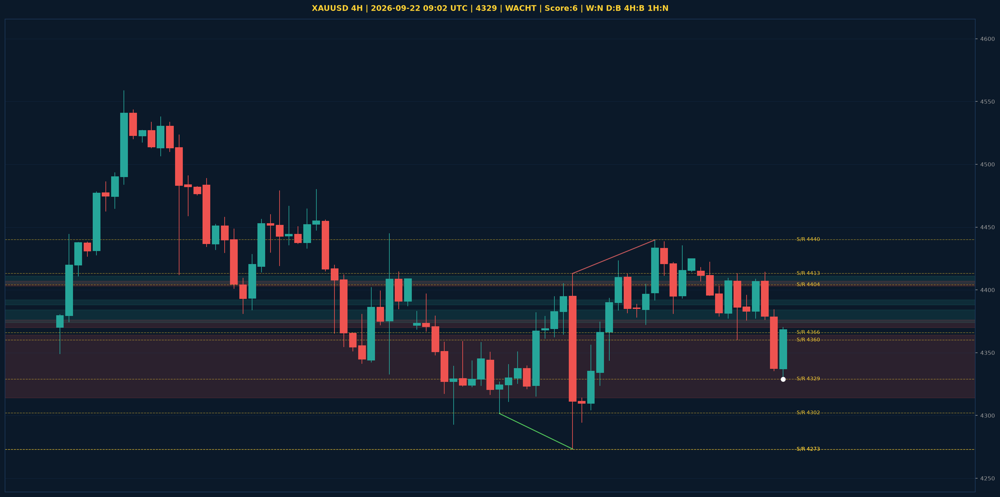

# XAUUSD Liquidity Sweep Analyse - 2026-09-22 09:02 UTC

> Prijs: 4329 | Beslissing: WACHT | Score: 6

---

## Liquidity Sweep

- **Manipulatie:** BULLISH @ 4328
- **5m reversal (BOS/iFVG):** bevestigd (iFVG: BULLISH)
- **1m entry trigger:** bevestigd
- **DXY 5m trend:** BULLISH | **Correlatie:** niet aligned
- **Draws on liquidity (highs):** [4371.0, 4384.0, 4414.0, 4435.0]
- **Draws on liquidity (lows):** [4328.0, 4336.0]

---

## Grafiek

---

## Top-Down Trend

| TF | Trend |
|---|---|
| Weekly | NEUTRAAL |
| Daily | BULLISH |
| 4H | BEARISH |
| 1H | NEUTRAAL |
| 30min | BULLISH |
| 5min | NEUTRAAL |

## Fibonacci (swing 3955 - 4755)

| Level | Prijs |
|---|---|
| 23.6% | 4566 |
| 38.2% | 4450 |
| 50.0% | 4355 |
| 61.8% | 4261 |
| 78.6% | 4127 |

## S/R

Daily: [3994.0, 4171.0, 4216.0, 4273.0, 4329.0, 4366.0, 4404.0, 4755.0]
4H: [4273.0, 4302.0, 4360.0, 4413.0, 4440.0]
1H: [4360.0, 4378.0, 4413.0, 4435.0]

*MVR Trading Agent | 2026-09-22 09:02 UTC*
