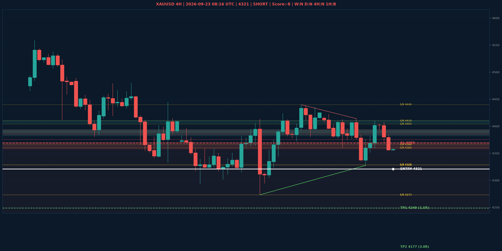

# XAUUSD Liquidity Sweep Analyse - 2026-09-23 08:16 UTC

> Prijs: 4321 | Beslissing: SHORT | Score: -8

---

## Liquidity Sweep

- **Manipulatie:** BEARISH @ 4358
- **5m reversal (BOS/iFVG):** bevestigd (iFVG: BEARISH)
- **1m entry trigger:** bevestigd
- **DXY 5m trend:** BULLISH | **Correlatie:** OK
- **Draws on liquidity (highs):** [4358.0, 4384.0, 4410.0, 4414.0]
- **Draws on liquidity (lows):** [4328.0, 4354.0, 4355.0]

---

## Grafiek

---

## Top-Down Trend

| TF | Trend |
|---|---|
| Weekly | NEUTRAAL |
| Daily | NEUTRAAL |
| 4H | NEUTRAAL |
| 1H | BEARISH |
| 30min | NEUTRAAL |
| 5min | NEUTRAAL |

## Fibonacci (swing 3955 - 4755)

| Level | Prijs |
|---|---|
| 23.6% | 4566 |
| 38.2% | 4450 |
| 50.0% | 4355 |
| 61.8% | 4261 |
| 78.6% | 4127 |

## S/R

Daily: [3994.0, 4171.0, 4216.0, 4273.0, 4329.0, 4366.0, 4404.0, 4755.0]
4H: [4273.0, 4328.0, 4360.0, 4410.0, 4440.0]
1H: [4328.0, 4360.0, 4378.0, 4408.0]

## Trade Setup

| | |
|---|---|
| Entry | 4321 |
| Stop Loss | 4369 |
| TP1 | 4249 (1.5R) |
| TP2 | 4177 (3.0R) |

*MVR Trading Agent | 2026-09-23 08:16 UTC*
