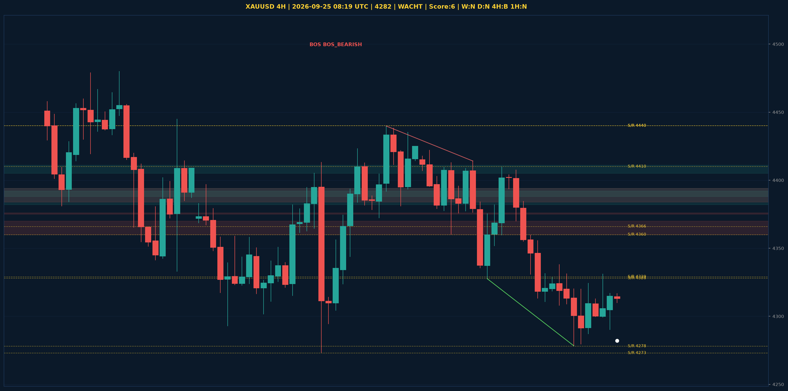

# XAUUSD Liquidity Sweep Analyse - 2026-09-25 08:19 UTC

> Prijs: 4282 | Beslissing: WACHT | Score: 6

---

## Liquidity Sweep

- **Manipulatie:** BULLISH @ 4310
- **5m reversal (BOS/iFVG):** bevestigd (iFVG: BULLISH)
- **1m entry trigger:** niet bevestigd
- **DXY 5m trend:** BEARISH | **Correlatie:** OK
- **Draws on liquidity (highs):** [4317.0, 4331.0, 4356.0]
- **Draws on liquidity (lows):** [4278.0, 4290.0, 4310.0]

---

## Grafiek

---

## Top-Down Trend

| TF | Trend |
|---|---|
| Weekly | NEUTRAAL |
| Daily | NEUTRAAL |
| 4H | BEARISH |
| 1H | NEUTRAAL |
| 30min | NEUTRAAL |
| 5min | NEUTRAAL |

## Fibonacci (swing 3955 - 4755)

| Level | Prijs |
|---|---|
| 23.6% | 4566 |
| 38.2% | 4450 |
| 50.0% | 4355 |
| 61.8% | 4261 |
| 78.6% | 4127 |

## S/R

Daily: [3994.0, 4171.0, 4216.0, 4273.0, 4329.0, 4366.0, 4440.0, 4755.0]
4H: [4278.0, 4328.0, 4360.0, 4410.0, 4440.0]
1H: [4278.0, 4299.0, 4324.0, 4338.0, 4408.0]

*MVR Trading Agent | 2026-09-25 08:19 UTC*
