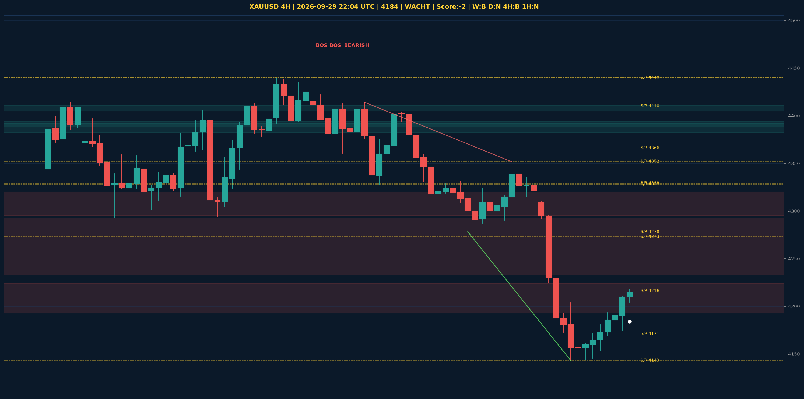

# XAUUSD Liquidity Sweep Analyse - 2026-09-29 22:04 UTC

> Prijs: 4184 | Beslissing: WACHT | Score: -2

---

## Liquidity Sweep

- **Manipulatie:** BEARISH @ 4218
- **5m reversal (BOS/iFVG):** niet bevestigd (iFVG: geen)
- **1m entry trigger:** niet bevestigd
- **DXY 5m trend:** NEUTRAAL | **Correlatie:** niet aligned
- **Draws on liquidity (highs):** [4181.0, 4193.0, 4218.0, 4295.0]
- **Draws on liquidity (lows):** [4143.0, 4144.0, 4153.0, 4169.0, 4174.0]

---

## Grafiek

---

## Top-Down Trend

| TF | Trend |
|---|---|
| Weekly | BEARISH |
| Daily | NEUTRAAL |
| 4H | BEARISH |
| 1H | NEUTRAAL |
| 30min | BULLISH |
| 5min | NEUTRAAL |

## Fibonacci (swing 3955 - 4755)

| Level | Prijs |
|---|---|
| 23.6% | 4566 |
| 38.2% | 4450 |
| 50.0% | 4355 |
| 61.8% | 4261 |
| 78.6% | 4127 |

## S/R

Daily: [3994.0, 4171.0, 4216.0, 4273.0, 4329.0, 4366.0, 4440.0, 4755.0]
4H: [4143.0, 4278.0, 4328.0, 4352.0, 4410.0, 4440.0]
1H: [4144.0, 4174.0, 4204.0, 4336.0, 4352.0]

*MVR Trading Agent | 2026-09-29 22:04 UTC*
