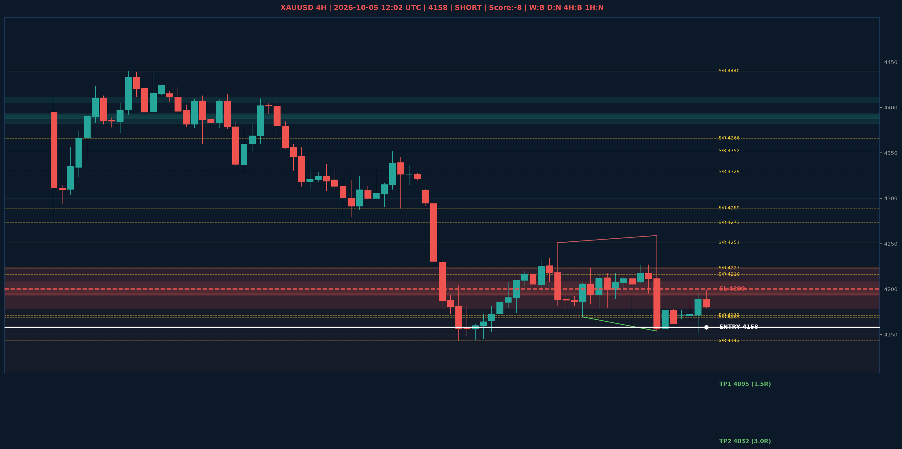

# XAUUSD Liquidity Sweep Analyse - 2026-10-05 12:02 UTC

> Prijs: 4158 | Beslissing: SHORT | Score: -8

---

## Liquidity Sweep

- **Manipulatie:** BEARISH @ 4195
- **5m reversal (BOS/iFVG):** bevestigd (iFVG: BEARISH)
- **1m entry trigger:** bevestigd
- **DXY 5m trend:** BULLISH | **Correlatie:** OK
- **Draws on liquidity (highs):** [4195.0, 4199.0, 4259.0]
- **Draws on liquidity (lows):** [4152.0, 4179.0]

---

## Grafiek

---

## Top-Down Trend

| TF | Trend |
|---|---|
| Weekly | BEARISH |
| Daily | NEUTRAAL |
| 4H | BULLISH |
| 1H | NEUTRAAL |
| 30min | NEUTRAAL |
| 5min | BEARISH |

## Fibonacci (swing 3955 - 4755)

| Level | Prijs |
|---|---|
| 23.6% | 4566 |
| 38.2% | 4450 |
| 50.0% | 4355 |
| 61.8% | 4261 |
| 78.6% | 4127 |

## S/R

Daily: [4143.0, 4171.0, 4216.0, 4273.0, 4329.0, 4366.0, 4440.0, 4755.0]
4H: [4143.0, 4169.0, 4223.0, 4251.0, 4289.0, 4352.0]
1H: [4152.0, 4179.0, 4195.0, 4259.0]

## Trade Setup

| | |
|---|---|
| Entry | 4158 |
| Stop Loss | 4200 |
| TP1 | 4095 (1.5R) |
| TP2 | 4032 (3.0R) |

*MVR Trading Agent | 2026-10-05 12:02 UTC*
