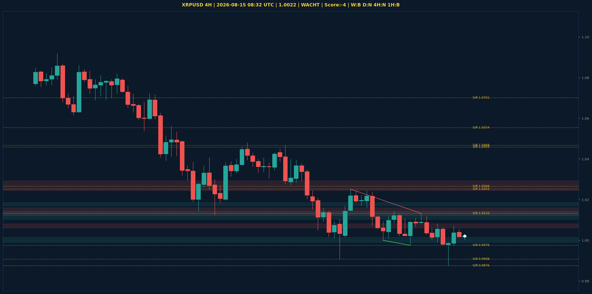

# XRPUSD Liquidity Sweep Analyse - 2026-08-15 08:32 UTC

> Prijs: 1.0022 | Beslissing: WACHT | Score: -4

---

## Liquidity Sweep

- **Manipulatie:** BEARISH @ 1.0030
- **5m reversal (BOS/iFVG):** bevestigd (iFVG: BEARISH)
- **1m entry trigger:** niet bevestigd
- **BTC 5m trend:** BULLISH | **Correlatie:** niet aligned
- **Draws on liquidity (highs):** [1.003, 1.007, 1.0083, 1.0133]
- **Draws on liquidity (lows):** [0.9876, 0.9973, 1.0002]

---

## Grafiek

---

## Top-Down Trend

| TF | Trend |
|---|---|
| Weekly | BEARISH |
| Daily | NEUTRAAL |
| 4H | NEUTRAAL |
| 1H | BEARISH |
| 30min | BEARISH |
| 5min | NEUTRAAL |

## Fibonacci (swing 0.9884 - 1.4011)

| Level | Prijs |
|---|---|
| 23.6% | 1.3037 |
| 38.2% | 1.2435 |
| 50.0% | 1.1948 |
| 61.8% | 1.1461 |
| 78.6% | 1.0767 |

## S/R

Daily: [1.0266, 1.0459, 1.0554, 1.0701, 1.1275, 1.1628, 1.1812, 1.2893]
4H: [0.9876, 0.9908, 0.9976, 1.0133, 1.0252, 1.0468]
1H: [0.9876, 0.9976, 1.0022, 1.007, 1.0106]

*MVR Trading Agent | 2026-08-15 08:32 UTC*
