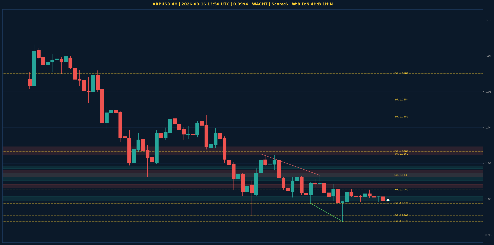

# XRPUSD Liquidity Sweep Analyse - 2026-08-16 13:50 UTC

> Prijs: 0.9994 | Beslissing: WACHT | Score: 6

---

## Liquidity Sweep

- **Manipulatie:** BULLISH @ 0.9990
- **5m reversal (BOS/iFVG):** bevestigd (iFVG: BULLISH)
- **1m entry trigger:** bevestigd
- **BTC 5m trend:** NEUTRAAL | **Correlatie:** niet aligned
- **Draws on liquidity (highs):** [1.0, 1.0016, 1.0024, 1.0052, 1.007]
- **Draws on liquidity (lows):** [0.9876, 0.9962, 0.9985, 0.999]

---

## Grafiek

---

## Top-Down Trend

| TF | Trend |
|---|---|
| Weekly | BEARISH |
| Daily | NEUTRAAL |
| 4H | BEARISH |
| 1H | NEUTRAAL |
| 30min | NEUTRAAL |
| 5min | NEUTRAAL |

## Fibonacci (swing 0.9884 - 1.3949)

| Level | Prijs |
|---|---|
| 23.6% | 1.2990 |
| 38.2% | 1.2396 |
| 50.0% | 1.1917 |
| 61.8% | 1.1437 |
| 78.6% | 1.0754 |

## S/R

Daily: [1.0266, 1.0459, 1.0554, 1.0701, 1.1275, 1.1628, 1.1812, 1.2893]
4H: [0.9876, 0.9908, 0.9976, 1.0052, 1.0133, 1.0252]
1H: [0.9962, 0.9995, 1.0031]

*MVR Trading Agent | 2026-08-16 13:50 UTC*
